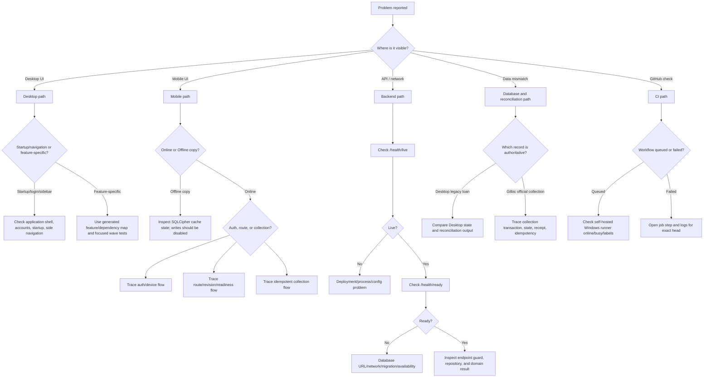

# Cross-Layer Debugging Playbook

Use this playbook to find the failing layer before changing code. The goal is to trace one event from the screen to the authoritative record with enough evidence to reproduce it safely.

## First rule: do not debug by guessing

Before editing anything, record:

- what the user did
- where they did it
- the exact message shown
- whether the action was read-only or a write
- the date and time in Asia/Manila
- the app build/commit or pull-request head
- whether the user was online or viewing an offline copy
- whether the same behavior appears on another approved device or account

Then identify the owner in [`system-map.md`](system-map.md).

## Safe evidence checklist

Capture these when relevant:

| Evidence | Example / purpose |
|---|---|
| Timestamp | `2026-08-01 11:45 Asia/Manila` |
| Surface | Desktop, Gilbic Mobile, FastAPI, PostgreSQL, Supabase Auth, CI, deployment |
| Commit/build | Git SHA, PR number, Flutter app version/build |
| Account context | Internal user ID, username, role, permissions; never password |
| Device context | Platform and server-side device record/status; never raw installation ID in a public issue |
| Request context | Endpoint, HTTP status, safe error code, contract version |
| Route context | collector ID, area, client ID, loan ID, route revision |
| Collection context | entry type, collection date, idempotency/client transaction UUID, device sequence |
| Result context | server transaction ID, receipt number, official balance, accepted time |
| Database context | table/schema, record IDs, migration version; redact credentials and unrelated client data |
| CI context | workflow run ID, job ID, failing step, exact head SHA |

Never collect or paste:

- passwords
- bearer or refresh tokens
- database URLs or passwords
- Supabase secret/service keys
- raw app installation IDs
- private client documents unrelated to the bug
- full production database dumps in an issue

## Triage decision tree



## Layer-by-layer checks

### A. SPINA Desktop

Start here for:

- startup, account, sidebar, or missing-tab errors
- Data Bank, Clients, Reports, Collector Route, Dashboard, Cash Control, or backup problems
- Regular/7x7 calculation disagreement
- Tkinter callback errors

#### 1. Locate the owner

Use:

- [`feature-map.md`](feature-map.md) — feature and risk overview
- [`function-index.md`](function-index.md) — exact symbol location
- [`dependency-map.md`](dependency-map.md) — callers and dependencies
- [`database-access-map.md`](database-access-map.md) — tables and SQL access
- [`risk-map.md`](risk-map.md) — financial/write/authentication/backup risk
- `architecture-map.json` — machine-readable detail

#### 2. Check final runtime ownership

Many old errors were caused by missing dependency injection or duplicate monkey patches. Verify:

- the final `spina_app/features/*` installer is called
- the installer is idempotent
- required helper functions are injected before callbacks execute
- a stale installed marker does not hide missing methods
- the old duplicate wrapper has not returned
- startup order remains accounts → side navigation → startup runtime

Typical symptom patterns:

| Symptom | Likely cause |
|---|---|
| `NameError` for `_spina_*` helper | Extracted helper not imported/injected into final feature namespace |
| `App` has no attribute | Installer aborted early or stale marker says installed while binding is missing |
| Tab missing after login | role/sidebar rebuild or hidden-tab restoration problem |
| Duplicate controls or repeated refresh | old wrapper and final installer both own the lifecycle |
| Error during app close/theme change | scheduled Tk callback or event runs after root destruction |

#### 3. Calculation problems

Do not patch the display first.

For Regular or 7x7 disagreement:

1. Identify the loan cycle and original/current principal.
2. List current-cycle transactions in date order.
3. Separate Payment, ADV, PASS, and blank dates.
4. Confirm renewal boundaries and due-date cycle.
5. Run or inspect protected calculation tests.
6. Compare Dashboard, Cash Control, Reports, and Collector Route outputs against the same service rule.

7x7 invariants:

- every started ₱1,000 of recorded/current principal carries ₱7 daily interest
- the daily interest basis stays fixed for that loan cycle
- payment covers interest before principal
- completion is principal-based
- a mobile generic balance subtraction is not valid

#### 4. Useful local checks

From the repository root on Windows:

```powershell
python -m py_compile OFFICIAL_SPINA_APP_PostgreSQL_TEST_v33_stability_performance_fixed.py
python tools/test_architecture_map.py
```

Run the focused permanent wave test for the owning feature, then the closest compatibility tests. Avoid running a destructive manual test on production data.

### B. Gilbic Mobile

Start here for:

- login screen, session restore, route display, offline copy, collection form, or user-facing error problems
- device identity/header issues
- incorrect retry behavior

Key paths:

```text
gilbic_mobile/lib/src/app.dart
gilbic_mobile/lib/src/core/auth/
gilbic_mobile/lib/src/core/device/
gilbic_mobile/lib/src/core/collector/
gilbic_mobile/lib/src/core/payments/
gilbic_mobile/lib/src/features/collector/
gilbic_mobile/test/
```

Useful checks:

```powershell
cd gilbic_mobile
flutter pub get
flutter analyze --fatal-infos
flutter test
```

#### Mobile questions

1. Is the screen showing **Online route** or **Offline copy**?
2. Is the user session present and unexpired?
3. Was the installation identity loaded before the request?
4. Are `Authorization` and `X-Device-Id` sent on the protected request?
5. Does the route entry contain client ID, loan ID, route revision, and readiness fields?
6. Is the user missing `collection.create`?
7. Is the loan explicitly blocked by the server or by the 7x7 safety gate?
8. After a network-uncertain write, did the UI preserve the exact draft and show **Retry same entry**?

Never solve a mobile display problem by calculating a replacement official balance in Dart.

### C. FastAPI backend

Start here for:

- HTTP errors
- failed login/device checks
- missing route entries
- stale revisions
- rejected/duplicate/conflicting collection writes
- management account/device administration

Key paths:

```text
gilbic_backend/src/gilbic_backend/main.py
gilbic_backend/src/gilbic_backend/account_repository.py
gilbic_backend/src/gilbic_backend/collector_route_api.py
gilbic_backend/src/gilbic_backend/collector_route_repository.py
gilbic_backend/src/gilbic_backend/collection_api.py
gilbic_backend/src/gilbic_backend/collection_posting.py
gilbic_backend/sql/
gilbic_backend/tests/
spina_backend_mobile/
```

#### Health sequence

1. `GET /health/live`
2. `GET /health/ready`
3. `GET /api/v1/meta`
4. Reproduce the exact protected endpoint with a safe test account/device.

Interpretation:

| Result | Meaning |
|---|---|
| Live fails | process, routing, deployment, or startup configuration problem |
| Live passes, ready fails | database network, URL, credential, schema, or migration problem |
| Both pass, protected API fails | authentication, account, device, permission, assignment, revision, or business validation |
| API accepts, UI shows wrong result | response parsing/presentation problem; compare raw safe response fields |

Useful backend checks:

```powershell
python -m pip install -e ./spina_backend_mobile
python -m pip install -e './gilbic_backend[test]'
python -m pytest gilbic_backend/tests
```

### D. Supabase Auth and application authorization

Keep identity and authorization separate.

#### Authentication trace

1. Supabase Auth verifies password/session.
2. FastAPI maps the external Auth user to `core.users`.
3. FastAPI checks account status.
4. FastAPI resolves roles and permissions from private tables.
5. FastAPI hashes `X-Device-Id` and requires an active matching device.

Common distinctions:

| Symptom | Check first |
|---|---|
| Correct password rejected | Supabase Auth request/config/account state |
| Login succeeds but endpoint forbidden | private role/permission mapping |
| Collector login returns `HTTP 403` / `device_approval_required` | Verify `core.devices.status = 'pending'`, the Collector role, Android/iOS platform, and the `device_approval_required` response. Do not inspect or share a device identifier hash. |
| Token still valid but device is revoked | Verify the server-side `core.devices` status is revoked; a valid bearer token does not override device revocation. Do not inspect or share a device identifier hash. |
| Staff cannot self-register | expected; staff must be invited by Management |
| Role appears different from Auth metadata | expected; Auth metadata is not authoritative |

### E. Collector route

Trace these fields together:

- authenticated collector user ID
- active device
- `route.view` permission
- assigned areas
- client ID and loan ID
- collection-state reconciliation status
- `route_revision`
- `can_collect_mobile`
- `can_enter_payment`
- `collection_message`

Common cases:

| Symptom | Likely owner/check |
|---|---|
| Entire route empty | account/permission/device, collector-area assignments, business date |
| One client missing | active client/loan filters, assigned area normalization, reconciliation |
| Client visible but button disabled | expected readiness/loan-mode/7x7 safety gate |
| Route appears old | offline cache label and synchronization time |
| Submit says refresh | stale `route_revision`; reload route before creating a new draft |

### F. Payment, ADV, and PASS

Use one transaction story from start to finish.

Required identifiers:

```text
client_transaction_id / Idempotency-Key / X-Client-Transaction-Id
registered device record and device_sequence
collector user ID
route_entry_id
client_id
loan_id
collection_date
entry_type
route_revision
server transaction ID
receipt number
official balance
```

#### Outcome interpretation

| Outcome | Meaning | Next action |
|---|---|---|
| Accepted | One official atomic transaction committed | show receipt/balance; refresh route |
| Duplicate / already recorded | Original identical transaction already committed | treat as success; show original receipt |
| Idempotency mismatch | Same UUID was reused with changed data | stop; inspect caller; never overwrite original meaning |
| Stale route conflict | Loan state changed after route download | refresh route and create a new reviewed draft |
| Rejected business rule | No official write committed | show safe reason; correct input or use Desktop |
| Network uncertain | Client does not know whether server committed | preserve exact draft and retry same identifiers |
| Device sequence conflict | Sequence was already consumed or store is inconsistent | inspect secure sequence storage and server record |
| Unreconciled/unsupported loan | Server cannot safely apply generic logic | reconcile or use SPINA Desktop |

#### Atomicity check

For an accepted entry, these should agree inside one PostgreSQL transaction:

- immutable collection transaction
- updated authoritative collection state
- loan status if paid
- receipt
- audit event
- idempotency replay result

A partial set is a critical transactional bug.

#### PASS and ADV checks

- one PASS per loan/date
- PASS cannot conflict with ADV coverage
- ADV requires valid start/end coverage dates
- a normal Payment cannot carry ADV coverage fields
- displayed coverage comes from the authoritative server result/route

### G. PostgreSQL and reconciliation

Before querying production, reproduce on a safe database when possible.

Determine whether the issue belongs to:

1. Existing Desktop operational tables/state.
2. `core` identity/authorization/device records.
3. `lending` clients, loans, assignments, state, and transactions.
4. `mobile` idempotency support.

For state mismatch:

- compare the same client/loan cycle
- confirm IDs are linked correctly
- compare transactions in date order
- verify reconciliation version/state
- verify the loan type’s mobile feature flag and balance mode
- do not enable a loan type merely to make the button appear

### H. GitHub Actions and self-hosted runner

#### Queued workflow

Check:

- Windows runner application is running
- runner is online in repository settings
- labels include `self-hosted`, `Windows`, and `X64`
- another long job is not occupying it
- the workflow’s owner/branch guard permits the PR
- the PR head changed after the queued run was created

#### Failed workflow

Always inspect:

1. exact PR head SHA
2. run ID
3. job ID
4. failing step
5. first meaningful error, not only the final exit code
6. whether generated files or dependency resolution changed the tree

Typical categories:

| Step | Likely cause |
|---|---|
| Checkout/guard skipped | actor, same-repository, or branch condition |
| Flutter setup/pub get | SDK/network/package lock |
| `flutter analyze` | type, import, lint, async context, dead code |
| `flutter test` | behavior/widget/regression mismatch |
| Python compile | syntax/import error |
| pytest | contract, database, migration, atomicity, or fixture issue |
| architecture zero-diff | source changed without regenerating maps |
| clean-tree check | test/tool generated uncommitted files |

## Symptom-to-owner quick table

| User report | Start in | Then inspect |
|---|---|---|
| “App does not open” | Desktop startup or Mobile app composition | startup runtime/application shell or `app.dart` |
| “Login does not work” | Supabase Auth request | account mapping, status, role, device |
| “Access removed suddenly” | device guard | Management device status and account status |
| “Collector has no clients” | route API/repository | assignments, business date, active loans, reconciliation |
| “Client appears but cannot collect” | readiness fields | loan configuration, reconciliation, 7x7 gate |
| “Payment disappeared after timeout” | idempotency trace | retry same UUID, find original transaction/receipt |
| “Payment duplicated” | client retry identifiers and backend uniqueness | UUID/body, device sequence, database constraints |
| “Balance is wrong” | authoritative calculation/state | loan cycle, transactions, reconciliation, Regular vs 7x7 |
| “ADV/PASS is wrong” | collection validation/state | date coverage, existing transaction, route revision |
| “Offline route is old” | mobile cache | synchronization timestamp; reconnect and refresh |
| “CI is stuck” | self-hosted runner | runner online/busy/labels and workflow guard |
| “Desktop button/function missing” | final feature installer | dependency injection, installed marker, duplicate cleanup |
| “Portal differs from mobile/backend” | external/legacy boundary | identify which backend/repository it actually uses |

## Reproduction standard

A good bug is reproducible with:

1. One safe account and role.
2. One client and loan ID or one disposable test record.
3. Exact starting state.
4. Exact numbered actions.
5. Expected and actual result.
6. Timestamp and build/commit.
7. Relevant safe identifiers.
8. Sanitized logs or screenshot.
9. Statement of whether it reproduces after refresh/restart.
10. Statement of whether it reproduces in a safe test database.

Use the repository’s **SPINA cross-layer bug report** issue template to collect this consistently.

## Fix verification standard

After a fix:

- add a focused regression for the root cause
- run neighboring compatibility tests
- verify the authoritative record, not only the UI
- test duplicate/retry/rollback paths for writes
- test revoked/forbidden/stale paths for protected APIs
- use disposable data for destructive operations
- regenerate architecture maps when desktop Python ownership changes
- update [`progress-map.md`](progress-map.md) if milestone status changed
- record the PR, exact head, validation, and manual result
