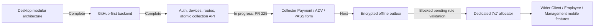

# Product Progress Map

**Snapshot date:** 2026-08-01, Asia/Manila  
**Repository:** `GILBIC/spina-lending-app`

This page answers four questions:

1. What is already complete?
2. What is being worked on now?
3. What is deliberately blocked?
4. What should we build next?

## Executive status

## Current critical path

1. **PR #225:** exact-head Flutter validation passed in GitHub Actions run #30; complete the real emulator or phone acceptance test.
2. Merge only after the online Regular-loan flow, confirmation, safe retry, official receipt/balance display, offline read-only behavior, and 7x7 block are manually verified.
3. Build the encrypted offline outbox while preserving the original idempotency key and device sequence.
4. Reconcile legacy loan state and implement the dedicated 7x7 allocator before enabling 7x7 mobile payments or ADV.
5. Expand role-specific mobile screens and server APIs.

## Product workstreams

| Workstream | Status | Completed scope | Current gap / next gate |
|---|---|---|---|
| Desktop architecture | **Complete** | Generated architecture map; modular feature ownership; final account, sidebar, startup, and application-shell boundaries | Continue regenerating static maps when Python ownership changes |
| Desktop business rules | **Complete / protected** | Regular rules, renewal timing, ADV/PASS behavior, fixed-principal 7x7 daily interest, interest-first allocation regressions | Any new backend allocator must match these protected results |
| Desktop Data Bank | **Complete** | Grid, editor, writes, Delete Day, close/history/records, import, auto-close, audit, modular repository/service/feature boundary | Operational maintenance and performance monitoring |
| Desktop Clients | **Complete** | Add/edit, archive, pictures, history, linking, flexible schedules, renewals, modern application form, modular owner | Keep migrations and server/mobile identity mapping aligned |
| Desktop Reports | **Complete** | Reports UI, statement orchestration, PDF engine, notes, logs, 7x7 statement behavior, modular owner | Ensure future web/mobile statements use the same business source |
| Desktop Collector Route | **Complete** | Route repository/service/controller/report/presentation, historical schemas, health/conflict views, printing | Keep backend route assignments and readiness state synchronized |
| Desktop Dashboard/Cash Control | **Complete** | Modular dashboard, charts, loan-cycle service, cash-control reads/calculations/presentation | Server-side reporting APIs remain future work |
| Desktop authentication and shell | **Complete** | Account runtime, secure startup cancellation, final sidebar, application shell, safe shutdown | Desktop and Gilbic roles remain separate models until explicitly unified |
| Gilbic Flutter foundation | **Complete** | Role shell, configurable API, secure session storage, tests | Additional role screens |
| Mobile authentication | **Complete** | Supabase-backed login/registration/refresh/me/logout, backend-derived roles and permissions | Production invitation and account-lifecycle operations need deployment verification |
| Mobile device security | **Complete** | Random installation identity, secure storage, per-request device enforcement, revocation | Operational device-management UI and support procedures |
| Collector route mobile | **Complete** | Server-assigned route, readiness fields, route revision, SQLCipher offline snapshot, online/offline labeling | Legacy loan-state reconciliation coverage |
| Collection contract | **Complete** | Typed Payment/ADV/PASS drafts, UUID idempotency, conflict/duplicate/rejection parsing, retry rules | Offline outbox not yet implemented |
| Official collection backend | **Complete** | Atomic PostgreSQL transaction, receipt, balance/state update, audit, duplicate replay, locks, stale-route and device-sequence protection | Production migration/reconciliation and monitored rollout |
| Collector entry form | **In progress** | Implemented on draft PR #225 with online-only safety gates, safe manual retry, and exact-head Flutter CI passing in run #30 | Real emulator or phone acceptance test remains pending; PR is unmerged |
| Encrypted collection outbox | **Planned** | Contract rules already require preservation of key and sequence | Design encrypted queue, conflict handling, user-visible pending states, and retry worker |
| 7x7 mobile allocation | **Blocked** | Desktop 7x7 rule is protected and understood | Implement server allocator, reconcile test cases, prove parity, then selectively enable |
| Client mobile experience | **Planned** | Role shell exists | Loans, statements, receipts, renewal, notifications, profile/support APIs and screens |
| Employee mobile experience | **Planned** | Role shell exists | Attendance, payroll, tasks, requests APIs and screens |
| Management mobile experience | **Partly complete / planned** | Backend account/device administration exists | Management UI plus operations, finance, compliance, and reporting screens |
| Accounting/billing/tax/risk APIs | **Planned** | Desktop capabilities and management placeholders exist | Design server-owned models, permissions, audit, and reconciliation |
| Earlier local Client/Staff portals | **External / needs inventory** | Previously developed locally | Identify active deployment/source, document endpoints, and migrate required features into GitHub-first backend |
| Production deployment/observability | **Partly complete / needs proof** | Environment-based configuration, health endpoints, audit records, CI | Confirm production host, secrets, backups, logs, alerting, rollback, and runbooks |

## Milestone history

### Desktop stabilization and modularization

- **Wave 27:** permanent generated architecture map and dependency/risk/database indexes.
- **Waves 28–82:** Dashboard, navigation, Data Bank, Clients, Reports, Collector Route, Cash Control, Client Info Logs, shared presentation, repositories, services, and calculation protections were progressively modularized.
- **Waves 83–92:** account runtime, sidebar ownership, startup runtime, cleanup, permanent read-only validation, and final application shell were consolidated.

### Gilbic mobile and GitHub-first backend

| PR | Milestone | Status |
|---|---|---|
| #211 | Flutter mobile foundation | Merged |
| #212 | Real authentication and collector route | Merged |
| #213 | Encrypted offline collector route cache | Merged |
| #214 | Idempotent collection contract | Merged |
| #215 | Reusable FastAPI/PostgreSQL collection package | Merged |
| #216 | GitHub-first FastAPI foundation | Merged |
| #217 | PostgreSQL/Supabase schemas and readiness | Merged |
| #218 | Supabase authentication foundation | Merged |
| #219 | Persistent privacy-preserving device identity | Merged |
| #220 | Management account and device administration | Merged |
| #221 | One-time first Management bootstrap | Merged |
| #222 | Active-device enforcement on protected APIs | Merged |
| #223 | Supabase/PostgreSQL collector route API | Merged |
| #224 | Atomic and user-friendly official mobile collections | Merged |
| #225 | Guarded collector Payment/ADV/PASS form | **Open draft; CI passed; manual acceptance pending** |

## Known blockers and intentional safety gates

### 1. 7x7 mobile writes

**Blocked by design.** Generic balance subtraction cannot represent fixed daily interest and interest-first allocation. Keep Payment and ADV on SPINA Desktop until the server allocator passes parity tests.

### 2. Offline collection writes

**Blocked by design.** Offline route viewing is available, but collection writes require an encrypted outbox that preserves:

- idempotency UUID
- device sequence
- route revision
- original payload
- recorded time
- user/account ownership
- conflict and cancellation state

### 3. Legacy loan reconciliation

A route can be visible but not mobile-write ready. Legacy loans need an authoritative `loan_collection_state` reconciled from Desktop data before enabling collection.

### 4. Self-hosted Windows CI queue

Flutter and many desktop validations depend on the owner’s Windows X64 runner. A queued job may indicate the runner is offline or busy rather than a code failure.

### 5. Earlier local portal/backend code

The old local backend and portals are not fully represented in the GitHub-first map. Until inventoried, avoid making parallel fixes in both codebases.

## Recommended next waves

### Wave A — finish collector online entry

Definition of done:

- PR #225 checks pass on the exact head. **Passed in run #30.**
- Payment, ADV, PASS, duplicate replay, stale route, rejected entry, revoked device, and network uncertainty are tested.
- Regular-loan test entries match Desktop balances and receipts.
- 7x7 remains blocked.
- Progress map is updated from **In progress** to **Complete** only after merge.

### Wave B — encrypted offline outbox

Required design:

- SQLCipher-backed queue separated by authenticated user.
- Original draft identifiers never change during retry.
- Clear Pending, Sending, Needs refresh, Rejected, and Completed states.
- No background retry after sign-out or device revocation.
- Server duplicate replay is treated as success.
- Manual review path for changed route revision or business conflict.

### Wave C — legacy reconciliation and 7x7 allocator

Required design:

- Reconciliation report comparing Desktop transactions/state with server state.
- Disposable-database migration and rollback plan.
- 7x7 test matrix covering payment dates, gaps, ADV, PASS, interest-first allocation, principal changes, renewal cycles, and payoff.
- Exact parity with protected Desktop calculation tests.
- Loan-type feature flag remains off until approval.

### Wave D — wider role experiences

Build one vertical slice at a time:

1. Client loans and statement timeline.
2. Client receipts/proofs/renewal/notifications.
3. Employee attendance/payroll/tasks.
4. Management account/device interface.
5. Operations, accounting, billing/tax, risk/compliance APIs and screens.

## Definition of done for every future feature

A feature is not complete until all applicable boxes are satisfied:

- [ ] One named component owns the behavior.
- [ ] The authoritative data record is documented.
- [ ] Security and financial boundaries are explicit.
- [ ] Database migration is reproducible and rollback is understood.
- [ ] Unit, integration, concurrency, widget, and regression tests are added as appropriate.
- [ ] Exact-head CI is green.
- [ ] Safe manual test is completed using disposable or approved data.
- [ ] Debugging identifiers and user-facing errors are useful.
- [ ] No password, token, database URL, service key, or raw installation ID is logged.
- [ ] Architecture and progress documents are updated.
- [ ] The pull request is reviewed and merged to `main`.

## How to update this page

Change statuses only when evidence changes:

- Merged PR and passed validation → **Complete**
- Open branch/PR → **In progress**
- Explicit safety prerequisite missing → **Blocked**
- Direction accepted but no implementation → **Planned**
- Source or deployment not in this repository → **External / needs inventory**

Always include the pull request, test, migration, or deployment evidence in the corresponding change description.
