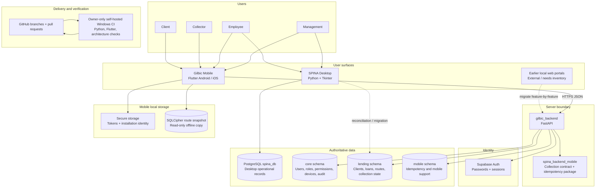
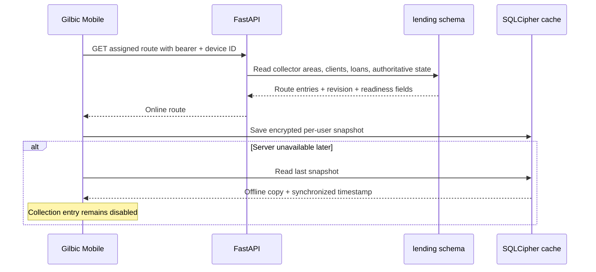
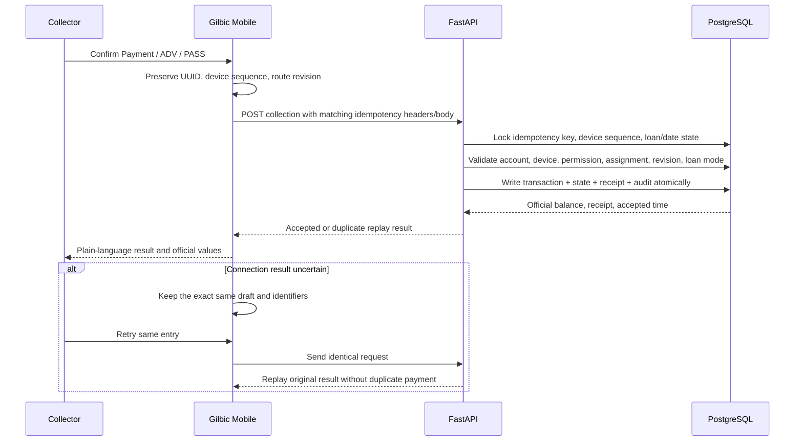
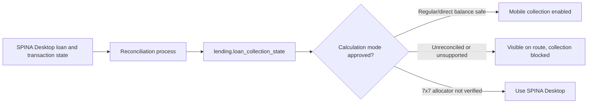
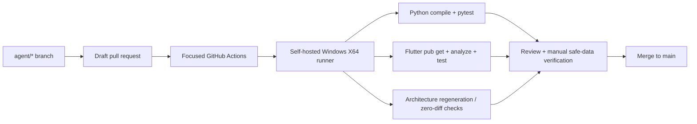

# Whole-System Architecture Map

**Scope:** SPINA Desktop, Gilbic Mobile, GitHub-first FastAPI, Supabase Auth, PostgreSQL, CI, and known legacy/external boundaries.

## Product at a glance



## Current vs intended

| Area | Current implemented behavior | Intended platform direction |
|---|---|---|
| SPINA Desktop | Mature Python/Tkinter and local PostgreSQL office workflows remain operational, including legacy role labels and modules that have not yet moved behind the GitHub-first API. | The primary office platform for canonical Management and Employee work, reusing the same FastAPI contracts, server permissions, official records, maker-checker controls, and audit outcomes as mobile. This is a migration of the current project, not a copy or reconnection of an old portal/backend. |
| Gilbic Mobile | Collector and Client flows plus incremental protected Management/Employee modules. Management now has a read-only live overview backed by one permission-filtered PostgreSQL snapshot and existing protected destinations. | Functional capability parity for appropriate Management and Employee workflows. Mobile layouts remain task-focused; they do not redefine roles, financial rules, approvals, or official results. Collector stays mobile-first. |
| Management and Employee access | Coverage differs by current client and module. Legacy Desktop labels still exist in local workflows; server-backed surfaces use canonical roles and granular permissions. Employee work evidence is fragmented across owning records and audit logs; there is no unified Employee Activity workspace. | Both clients recognize canonical Management and Employee roles. Accounting, HR/payroll, and client-relationship access remain separable; Management retains sensitive approvals and final authorization. A permission-scoped Employee Activity workspace links Management to authorized Employee work and owning review flows without impersonation, surveillance, or maker-checker bypass. Legacy labels are not the new role model. |
| Website | Earlier Client/Staff portal implementations remain external or legacy until inventoried. | Phase 1 public site and secure Client Web Portal; a later, separately scoped Staff Web Portal for selected remote workflows. No second authoritative backend and no automatic duplication of the entire Desktop app. |
| Office cash and growth planning | The live overview reports authoritative portfolio, collection, unremitted cash, queue, and activity aggregates only. | New Client Fund, renewal fund, and smart client capacity become separate server-authoritative modules for leaving manageable office cash, tracking it, and deciding when capacity supports another client. |

## Non-negotiable ownership rules

| Concern | Authoritative owner | Never owned by |
|---|---|---|
| Password hashing and authentication session | Supabase Auth | Flutter UI, Tkinter UI, browser JavaScript |
| Application role and permission | Private `core.*` tables through FastAPI | Supabase user metadata, Flutter state, browser metadata, client-provided role, or legacy Desktop labels such as Admin/Encoder/Viewer/System |
| Device approval and revocation | `core.devices` through FastAPI | A bearer token by itself |
| Collector area assignment | Server-side route assignment tables | Mobile-selected area |
| Official financial records, balance, receipt, and approval result | PostgreSQL transactions and protected server rules through FastAPI | Flutter, browser, or Desktop presentation totals; cached routes; manually typed dashboard totals |
| Employee work evidence and workflow state | Owning PostgreSQL domain records plus allowlisted audit evidence through permission-filtered FastAPI reads | Activity-screen counters, free-form audit text alone, screenshots, keystrokes, or Management impersonation |
| Regular and 7x7 business rules | Protected server/desktop calculation code and tests | Presentation widgets |
| Offline route display | SQLCipher snapshot on the phone | Official current balance source |
| Mobile retry identity | Original idempotency UUID plus device sequence | A newly generated UUID after uncertainty |
| Desktop feature wiring | `spina_app/features/*` installers and final application shell | Reintroduced duplicate monkey-patch chains |
| Progress status | Merged code, open PR state, and `progress-map.md` | Memory or an old local folder |

## Repository component map

### 1. SPINA Desktop

**Current responsibility:** mature office lending operations, financial rules, PostgreSQL-backed desktop workflows, reports, backups, and operational controls.

**Intended responsibility:** the primary office surface for permission-separated Management and Employee lending, collection, cash custody, remittance, accounting, HR/payroll, client-relationship, reporting, approval, audit, backup, and administration work. New Desktop modules must belong to this current repository and converge on the GitHub-first FastAPI authority; they must not copy or reconnect an old portal as a second backend.

Key locations:

- `OFFICIAL_SPINA_APP_PostgreSQL_TEST_v33_stability_performance_fixed.py` — compatibility entry file and remaining shared runtime.
- `spina_app/features/` — final idempotent feature installers and ownership boundaries.
- `spina_app/repositories/` — database access by feature.
- `spina_app/services/` — business transformations and financial rules.
- `spina_app/tabs/` and presentation modules — Tkinter views.
- `spina_app/calculation_rules.py` — protected Regular/7x7 calculation behavior.
- `tools/test_architecture_map.py` and related wave tests — permanent architecture and regression protection.

Major modularized feature owners:

| Feature | Main owner paths |
|---|---|
| Application startup | `spina_app/features/application_shell.py`, `spina_app/features/startup_runtime.py` |
| Accounts and login | `spina_app/features/accounts.py`, `spina_app/services/accounts.py`, login/header presentation modules |
| Side navigation | `spina_app/features/side_navigation.py` |
| Dashboard | `spina_app/features/dashboard.py`, `spina_app/repositories/dashboard.py`, `spina_app/services/loan_cycles.py`, `spina_app/tabs/dashboard.py` |
| Data Bank | `spina_app/features/data_bank.py`, `spina_app/repositories/data_bank.py`, `spina_app/services/data_bank.py`, Data Bank controller/presentation modules |
| Cash Control | `spina_app/features/cash_control.py`, `spina_app/repositories/cash_control.py`, `spina_app/services/cash_control.py` |
| Clients | `spina_app/features/clients.py`, Clients repository/service/controller/application modules |
| Client Info Logs | `spina_app/features/client_info_logs.py`, repository/service/tab modules |
| Reports | `spina_app/features/reports.py`, Reports repository/service/controller/engine/generation modules |
| Collector Route | `spina_app/features/collector_route.py`, repository/service/controller/report/presentation modules |
| Backup history | `spina_app/backup_history_presentation.py` plus desktop backup services |

Use the generated [`feature-map.md`](feature-map.md), [`dependency-map.md`](dependency-map.md), and [`function-index.md`](function-index.md) for symbol-level desktop tracing.

### 2. Gilbic Mobile

**Location:** `gilbic_mobile/`

**Primary responsibility:** role-based Client, Collector, Employee, and Management presentation; secure device identity; authenticated API calls; encrypted route cache; collector-friendly collection entry; and incremental functional capability parity with Desktop through shared server contracts.

Current internal boundaries:

- `lib/src/app.dart` — application composition and dependency wiring.
- `lib/src/core/auth/` — session models, storage, and authentication repository.
- `lib/src/core/device/` — persistent privacy-preserving installation identity.
- `lib/src/core/collector/` — route models, remote repository, encrypted cache, and cache-backed loader.
- `lib/src/core/payments/` — typed Payment/ADV/PASS contract, idempotency key, repository, and device sequence.
- `lib/src/core/management/` — strict Management models/repositories, including the protected live-overview contract.
- `lib/src/features/collector/` — route and collection-entry screens.
- `lib/src/features/management/` and `lib/src/features/dashboard/` — protected Management workflows, live priorities, and role-specific navigation.
- `test/` — authentication, device, cache, route, contract, and widget regressions.

Mobile safety boundary:

- No PostgreSQL or Supabase secret credential is stored in Flutter.
- A cached route is visibly offline and is not authoritative.
- Official balance and receipt values come from FastAPI.
- The live Management overview displays server aggregates only; it does not authorize a mutation or calculate New Client Fund, renewal fund, smart client capacity, balances, or receipts.
- All 7x7 mobile collection entry remains blocked until the dedicated allocator is verified.
- Automatic offline payment retry remains disabled until the encrypted outbox is implemented.

### 3. GitHub-first FastAPI backend

**Location:** `gilbic_backend/`

**Primary responsibility:** public API contract, Supabase session validation, application authorization, device enforcement, routes, management administration, and official collection transactions.

Important paths:

- `src/gilbic_backend/main.py` — application factory and router mounting.
- `src/gilbic_backend/account_repository.py` — authoritative account/device lookup.
- `src/gilbic_backend/collector_route_api.py` — collector route HTTP boundary.
- `src/gilbic_backend/collector_route_repository.py` — assigned route and collection-state reads.
- `src/gilbic_backend/collection_api.py` — collection HTTP boundary and request protection.
- `src/gilbic_backend/collection_posting.py` — atomic posting bridge and official effects.
- `src/gilbic_backend/management_dashboard_overview_api.py` and `management_dashboard_overview_repository.py` — active-device/role/permission-protected, actor-scoped, one-statement Management snapshot.
- `sql/` — reproducible private-schema migrations.
- `tests/` — API, repository, migration, atomicity, rollback, and concurrency tests.

Health boundaries:

```text
GET /health/live   -> process is running
GET /health/ready  -> required database connection is usable
GET /api/v1/meta   -> API metadata
```

Canonical APIs use `/api/v1/...`; mobile compatibility aliases use `/api/mobile/v1/...`.

### 4. Shared mobile collection package

**Location:** `spina_backend_mobile/`

**Primary responsibility:** reusable collection contract, validation, normalization, PostgreSQL idempotency behavior, and the transaction bridge boundary used by FastAPI.

It exists to prevent the API layer from inventing a second version of SPINA collection rules.

### 5. Supabase Auth and PostgreSQL

Supabase Auth proves identity and owns password/session mechanics. PostgreSQL owns application authorization and official records.

Private schemas introduced for Gilbic:

| Schema | Responsibility |
|---|---|
| `core` | users, roles, permissions, user-role mapping, devices, audit logs |
| `lending` | clients, loan types, loans, collector assignments, collection state, collection transactions |
| `mobile` | mobile idempotency and support records |

The mature SPINA Desktop operational data remains in the existing PostgreSQL database. Legacy loans must be reconciled into authoritative `lending.loan_collection_state` before the backend exposes them as mobile-write ready.

### 6. Earlier local backend and portals

Earlier Client Portal and Staff Portal work was developed against a local backend under paths such as `C:\SPINA_ONLINE\spina_backend`. That local code is not the current GitHub-first authority unless it has been migrated into this repository.

Treat these surfaces as **external / needs inventory**:

1. Identify whether they are still deployed or used.
2. Record their repository or exact source path.
3. List their endpoints and database tables.
4. Migrate required behavior into `gilbic_backend` one feature at a time.
5. Do not debug a production issue by editing both the old local backend and the GitHub-first backend simultaneously.

## Critical runtime flows

### Authentication and device registration

```mermaid
sequenceDiagram
    participant M as Gilbic Mobile
    participant A as FastAPI
    participant S as Supabase Auth
    participant C as core schema

    M->>M: Read installation identity from secure storage
    M->>A: Login + installation ID + app metadata
    A->>S: Verify username/email and password
    S-->>A: Auth user + access/refresh session
    A->>C: Load Gilbic user, role, permissions, and device state
    alt Collector Android/iOS unknown device
        A->>C: Persist core.devices pending
        A-->>M: HTTP 403 device_approval_required; no token response
    else Approved active device
        A-->>M: Session + server-derived role/permissions
        M->>M: Store session securely
    end

    Note over M,A: Every protected request sends bearer token and X-Device-Id
    A->>S: Validate bearer identity
    A->>C: Require active account and matching active device
```

The protected Collector-device state transition is:

```text
Collector Android/iOS unknown device -> core.devices pending -> HTTP 403 device_approval_required -> no token response
Management device.manage approval -> target-user lock -> selected device active -> other active Collector phones revoked -> audit in one transaction
```

Management account-directory reads require either `account.manage` or `device.manage`. Account and client-registration mutations retain `account.manage`; device status changes, including approval and revocation, retain `device.manage`. Raw installation identity is sent as `X-Device-Id` for authentication and device matching, but raw identifiers and hashes are not returned in management administration payloads or exposed in UI, log, or audit details.

### Collector route read and offline fallback



### Official Payment, ADV, or PASS



### Desktop-to-mobile loan readiness



## Financial rule boundary

Regular and 7x7 are not interchangeable calculation modes.

- Regular loans may use direct remaining-balance reduction only when their server configuration explicitly allows it.
- 7x7 daily interest remains fixed from the recorded/current principal for the loan cycle.
- 7x7 payments allocate interest before principal.
- A generic subtraction cannot replace the dedicated 7x7 allocator.
- The phone never calculates an official balance or receipt.

When a calculation disagrees, fix the protected calculation/reconciliation layer and its tests—not the UI label.

## CI and release map



A queued workflow often means the self-hosted Windows runner is offline, busy, or has not picked up the job. It does not automatically mean the code failed.

## Change-impact checklist

Before editing a component, answer:

1. Which layer owns the behavior?
2. Which record is authoritative?
3. Which IDs connect the request across layers?
4. Which business rule or security gate must remain unchanged?
5. Which unit, integration, widget, migration, architecture, and manual tests protect it?
6. Does the progress map need a status change?
7. Is an earlier local portal/backend also affected, or should it remain untouched?
