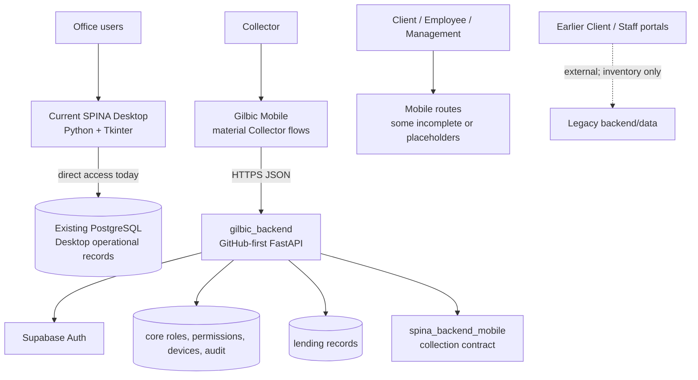
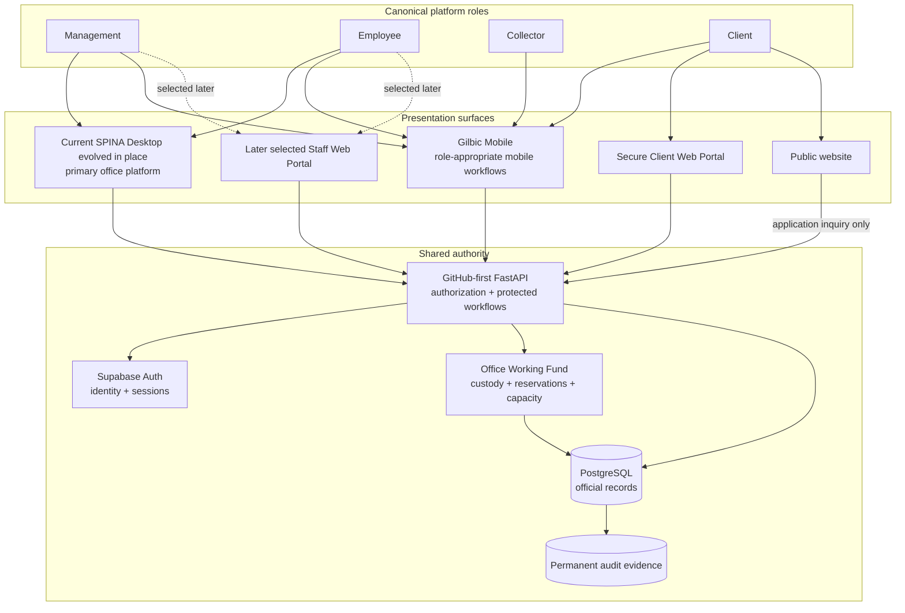
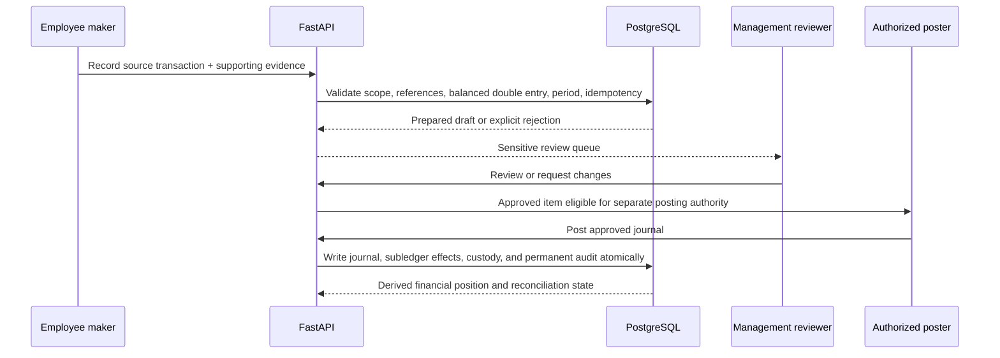
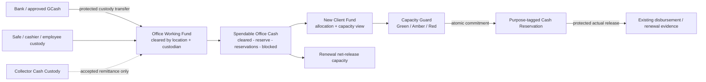

# Whole-System Architecture Map

**Scope:** current implementation and Management-approved future direction for
SPINA Desktop, Gilbic Mobile, website surfaces, GitHub-first FastAPI, Supabase
Auth, PostgreSQL, CI, and legacy/external boundaries.

Use [`platform-direction.md`](platform-direction.md) for intended product
behavior. This map identifies what exists now and the target ownership boundary;
it does not mark planned modules complete.

## Current implementation



Current facts:

- Desktop is the current repository's mature office application. It still has
  direct database paths and local `Admin`, `Encoder`, `Viewer`, `System` checks.
- FastAPI, Supabase authentication, private authorization/device records, and
  protected collection services exist, but do not yet cover every Desktop,
  Mobile, or future Web workflow.
- Flutter contains four role destinations and material Collector capability;
  Client, Employee, and Management functionality is incomplete.
- This repository contains no implemented public website or Client Web frontend
  package at this snapshot.
- Earlier portals/backends are not authoritative and may not be reconnected
  before inventory and feature-by-feature migration approval.

## Intended target



## Non-negotiable ownership rules

| Concern | Authoritative owner | Never authoritative |
|---|---|---|
| Identity and session | Supabase Auth | Tkinter, Flutter, browser metadata |
| Role, permission, separation of duties | Private PostgreSQL records enforced by FastAPI | Client-provided role; legacy Desktop profile |
| Approved device | Protected server device records | Bearer token alone; local installation claim |
| Official balance, receipt, journal, financial position | Protected PostgreSQL transaction/read model through FastAPI | UI calculation, cache, typed dashboard total |
| Spendable Office Cash and New Client Fund result | Protected custody, reconciliation, policy, reservation, and capacity records through FastAPI | Physical-purpose envelope, forecast receipt, editable Desktop total, AI output |
| Collector access | Server assignment or explicit delegation | Collector-selected area or client |
| Client access | Server ownership link to own records | User-supplied client identifier |
| Employee access | Individually granted capability and resource scope | Broad Employee UI visibility |
| Sensitive review/posting | Server maker-checker and permission policy | Same-actor self-approval |
| Correction | Linked protected reversal and replacement evidence | Delete or overwrite of a posted record |
| Future product direction | `platform-direction.md` plus approved GitHub amendments | Old local portal, screenshot, stale status note |
| Current behavior | Merged code, migrations, and tests | Future-direction wording |

## Product surface ownership

### SPINA Desktop

The current Python/Tkinter project remains the Desktop foundation and will
evolve in place. It is the target primary office surface for Management and
permission-based Employees. Current feature ownership remains under the entry
file and `spina_app/features`, `repositories`, `services`, `tabs`, and protected
calculation modules listed in the generated architecture map.

The direct PostgreSQL and local-profile paths are transitional. Migrate one
bounded domain at a time to FastAPI, with parity, reconciliation, negative
authorization, UAT, and recovery evidence. Do not copy an old Desktop into this
project and do not infer new access from `Admin`, `Encoder`, `Viewer`, or
`System`.

### Gilbic Mobile

`gilbic_mobile/` owns mobile presentation, secure session/device identity,
encrypted offline route snapshots, role navigation, and field entry. Collector
is mobile-first and limited to assigned/delegated scope. Cached values are
read-only copies, not official records. Client, Employee, and Management modules
must be described as planned or partial until their backend-connected workflows
and tests exist.

### GitHub-first FastAPI and shared package

`gilbic_backend/` owns the canonical API, Supabase session verification,
application authorization, device enforcement, protected commands, and official
responses. `spina_backend_mobile/` supplies the shared collection contract and
idempotent PostgreSQL boundary; it does not become a second public backend.

### Website surfaces

No website frontend is currently implemented in this repository. The planned
Phase 1 is a public company/inquiry website plus a separately secured Client Web
Portal. A Staff Web Portal is a later, separately scoped set of selected remote
workflows, not a full Desktop clone. Collector remains mobile-first.

### Earlier portals and backend

Any earlier Client Portal, Staff Portal, or local backend is external until its
source, deployment, endpoints, tables, users, data ownership, and security are
inventoried. Useful behavior may be reimplemented behind `gilbic_backend`; its
old authority and database must not be reconnected.

## Authorization and account cutover

```mermaid
sequenceDiagram
    participant M as Management
    participant I as Inventory and cutover service
    participant A as FastAPI authorization
    participant U as User
    participant L as Legacy Desktop access

    I->>I: Record legacy identity and actual duties
    Note over I: Old profile is evidence only; it cannot derive grants
    M->>A: Assign new canonical role, permissions, scopes, device policy
    A->>U: Exercise permitted workflows
    A-->>M: Positive and prohibited-access evidence
    M->>I: Accept account cutover
    I->>L: Disable this account's legacy login
    I->>I: Preserve immutable cutover and recovery evidence
```

## Employee accounting and Management reporting



Employees record and reconcile source events for assets, liabilities, and
equity. Management sees totals and drill-downs derived from posted evidence,
including the accounting equation, custody by bank/office/employee/collector,
unremitted cash, receivables, obligations, property location/custodian/condition
and depreciation, capital movements, retained earnings, profitability,
discrepancies, and queues. Posted corrections use reversals; no dashboard total
is a manual source field.

## Office Working Fund and New Client Fund boundary



There is one underlying cash and custody ledger. New Client Fund and renewal
capacity are purpose views and reservations against it, not additional money.
The New Client Fund Capacity Guard runs only after lending approval and tests the
exact proposed cash requirement against current headroom, forecast policy,
portfolio limits, and Collector/route operating capacity. Green can reserve
under valid delegated authority, Amber requires Management review, and Red
blocks funding with reason codes. FastAPI owns the decision; PostgreSQL
serializes reservations so concurrent approvals cannot overcommit cash.

Reservation is memorandum evidence, not a journal. The actual release consumes
the reservation and links protected disbursement, custody, accounting-source,
and audit evidence. Unremitted Collector custody is unavailable until accepted,
and forecast collections never satisfy the release-time cash test.

## Collector collection boundary

Official Payment, ADV, and PASS requests send the original idempotency identity,
device sequence, and route revision to FastAPI. The server validates account,
device, permission, assignment/delegation, loan rules, and current state, then
writes transaction, official receipt, state, custody, and audit atomically. An
uncertain retry reuses the same identifiers and must replay the same result.

Offline route snapshots remain encrypted and visibly non-authoritative. Offline
financial writes stay disabled unless a separate protected outbox design is
approved and verified.

## Financial rule boundary

Regular and 7x7 are distinct protected calculation modes. The presentation
surface never invents an official balance, receipt, allocation, journal, or
financial-position total. When a result disagrees, repair the authoritative
calculation, source evidence, reconciliation, or migration and its tests—not a
display label.

## CI and release boundary

Every change uses a focused branch and Draft PR, exact-head automated checks,
financial/security tests appropriate to risk, and explicit review evidence.
Master Issue #296 remains the release checklist. Documentation direction does
not authorize merge, deployment, restart, protected database mutation, or
production cutover.

## Change-impact checklist

Before editing a component, answer:

1. Is the statement current behavior or future intention?
2. Which server record and workflow own the result?
3. Which role, narrow permission, resource scope, device state, and
   separation-of-duty rule apply?
4. Which source, custody, financial, reconciliation, and audit evidence must
   remain linked?
5. Does the workflow affect cleared, reserved, blocked, or spendable office
   cash, and can concurrent commands overcommit it?
6. Which tests prove allowed and prohibited behavior?
7. Is a data migration or account cutover involved, and what is its recovery
   evidence?
8. Does Master Issue #296, Notion project memory, or Create State need a status
   update?
