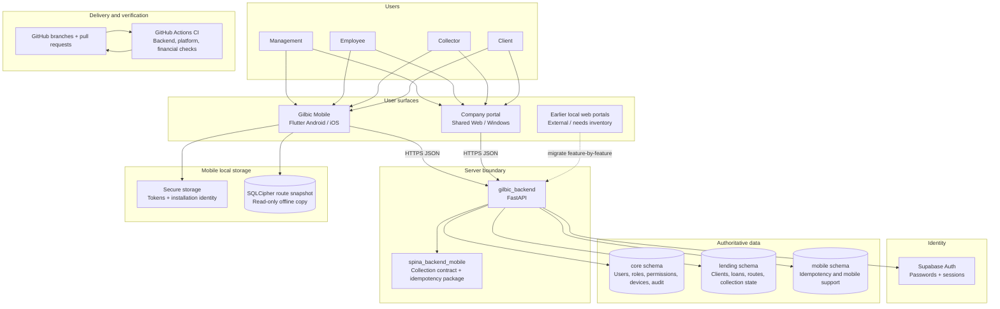
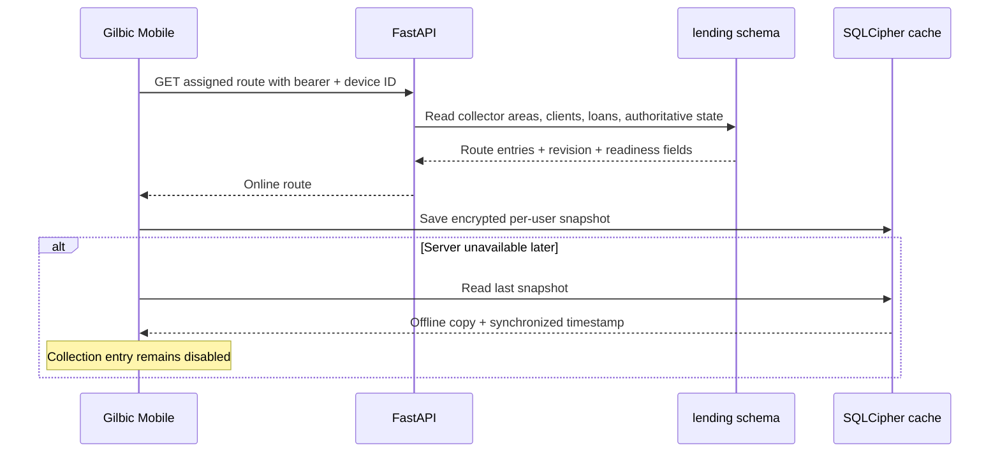
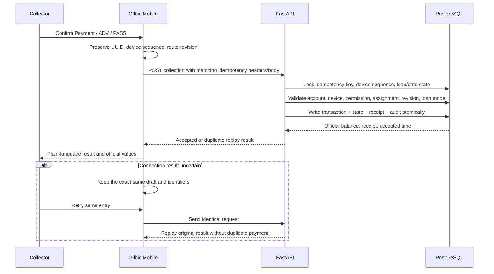
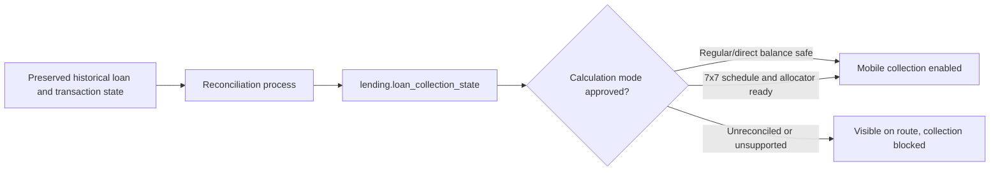
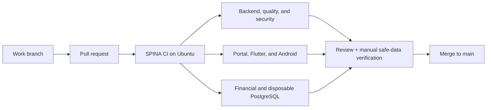

# Whole-System Architecture Map

**Scope:** shared Web/Windows portal, Gilbic Mobile, GitHub-first FastAPI, Supabase Auth, PostgreSQL, CI, and known legacy/external boundaries.

**Current acceptance state:** [29 September 2026](../release/2026-09-29-implementation-state.md). This map identifies code ownership; its historical examples are not production or device acceptance evidence.

## Product at a glance


```mermaid
flowchart TB
    subgraph USERS[Users]
        MANAGEMENT[Management]
        EMPLOYEE[Employee]
        COLLECTOR[Collector]
        CLIENT[Client]
    end

    subgraph SURFACES[User surfaces]
        MOBILE[Gilbic Mobile\nFlutter Android / iOS]
        PORTAL[Company portal\nShared Web / Windows]
        LEGACY[Earlier local web portals\nExternal / needs inventory]
    end

    subgraph API[Server boundary]
        FASTAPI[gilbic_backend\nFastAPI]
        CONTRACT[spina_backend_mobile\nCollection contract + idempotency package]
    end

    subgraph AUTH[Identity]
        SUPAAUTH[Supabase Auth\nPasswords + sessions]
    end

    subgraph DATA[Authoritative data]
        CORE[(core schema\nUsers, roles, permissions, devices, audit)]
        LENDING[(lending schema\nClients, loans, routes, collection state)]
        MOBILEDB[(mobile schema\nIdempotency and mobile support)]
    end

    subgraph LOCAL[Mobile local storage]
        SECURE[Secure storage\nTokens + installation identity]
        CACHE[(SQLCipher route snapshot\nRead-only offline copy)]
    end

    subgraph DELIVERY[Delivery and verification]
        GITHUB[GitHub branches + pull requests]
        CI[GitHub Actions CI\nBackend, platform, financial checks]
    end

    MANAGEMENT --> MOBILE
    EMPLOYEE --> MOBILE
    COLLECTOR --> MOBILE
    CLIENT --> MOBILE
    MANAGEMENT --> PORTAL
    EMPLOYEE --> PORTAL
    COLLECTOR --> PORTAL
    CLIENT --> PORTAL

    MOBILE -->|HTTPS JSON| FASTAPI
    PORTAL -->|HTTPS JSON| FASTAPI
    FASTAPI --> SUPAAUTH
    FASTAPI --> CORE
    FASTAPI --> LENDING
    FASTAPI --> MOBILEDB
    FASTAPI --> CONTRACT


    MOBILE --> SECURE
    MOBILE --> CACHE

    LEGACY -. migrate feature-by-feature .-> FASTAPI

    GITHUB --> CI
    CI --> GITHUB
```

## Current vs intended

| Area | Current implemented behavior | Intended platform direction |
|---|---|---|
| Windows | `spina_pc/` installs the company portal in Edge/Chrome app mode. The original Tkinter application and separate account authority are retired. | Shared FastAPI roles, permissions, records, approvals and financial outcomes across Web and Windows. |
| Gilbic Mobile | Collector and Client flows plus incremental protected Management/Employee modules. Management now has a read-only live overview backed by one permission-filtered PostgreSQL snapshot and existing protected destinations. | Functional capability parity for appropriate Management and Employee workflows. Mobile layouts remain task-focused; they do not redefine roles, financial rules, approvals, or official results. Collector stays mobile-first. |
| Management and Employee access | Current source includes protected Employee Activity and employee-operation/payroll modules with portal/mobile workspaces. Canonical roles and granular permissions govern server-backed access; actual staff/company settings and acceptance remain separately tracked. | Accounting, HR/payroll, and client-relationship access remain separable; Management retains sensitive approvals. Activity is a permission-filtered projection of owning-domain evidence, without impersonation or maker-checker bypass. Legacy labels are not the new role model. |
| Company portal | `spina_portal/` provides Client, Collector, Employee and Management workspaces through shared FastAPI authority. The dated state tracks remaining Collector parity and platform acceptance. | Web and shared Windows clients reuse the same permissions, financial owners and official outcomes. Earlier external portals are separate legacy inventory, not the current company portal. |
| Office cash and growth planning | The live overview reports authoritative portfolio, collection, unremitted cash, queue, and activity aggregates only. | New Client Fund, renewal fund, and smart client capacity become separate server-authoritative modules for leaving manageable office cash, tracking it, and deciding when capacity supports another client. |

## Non-negotiable ownership rules

| Concern | Authoritative owner | Never owned by |
|---|---|---|
| Password hashing and authentication session | Supabase Auth | Flutter UI, browser JavaScript |
| Application role and permission | Private `core.*` tables through FastAPI | Supabase user metadata, Flutter state, browser metadata or client-provided role |
| Device approval and revocation | `core.devices` through FastAPI | A bearer token by itself |
| Collector area assignment | Server-side route assignment tables | Mobile-selected area |
| Official financial records, balance, receipt, and approval result | PostgreSQL transactions and protected server rules through FastAPI | Flutter, browser, or Desktop presentation totals; cached routes; manually typed dashboard totals |
| Employee work evidence and workflow state | Owning PostgreSQL domain records plus allowlisted audit evidence through permission-filtered FastAPI reads | Activity-screen counters, free-form audit text alone, screenshots, keystrokes, or Management impersonation |
| Regular and 7x7 business rules | Protected server calculation code and tests | Presentation widgets |
| Offline route display | SQLCipher snapshot on the phone | Official current balance source |
| Mobile retry identity | Original idempotency UUID plus device sequence | A newly generated UUID after uncertainty |
| Progress status | Issue296, current PR heads/checks and the dated implementation/acceptance matrix | Archived progress notes, memory or an old local folder |

## Repository component map

### 1. Company portal and Windows

**Locations:** `spina_portal/` and `spina_pc/`.

The portal owns role-based presentation and calls the shared backend. The Windows installer opens that same site in browser app mode. Both use server-derived roles and permissions and never connect directly to PostgreSQL. The original Tkinter source, local login/account store, desktop-only tooling and generated maps have been removed. Existing historical business data and backups remain separate recovery/reconciliation evidence. The pure historical 7x7 calculation retained in `gilbic_backend/tests/reference_7x7_rules.py` is only an independent test oracle.

### 2. Gilbic Mobile

**Location:** `gilbic_mobile/`

**Primary responsibility:** role-based Client, Collector, Employee, and Management presentation; secure device identity; authenticated API calls; encrypted route cache; collector-friendly collection entry; and incremental functional capability parity with Desktop through shared server contracts.

Current internal boundaries:

- `lib/src/app.dart` — application composition and dependency wiring.
- `lib/src/core/auth/` — session models, storage, and authentication repository.
- `lib/src/core/device/` — persistent privacy-preserving installation identity.
- `lib/src/core/collector/` — route models, remote repository, encrypted cache, and cache-backed loader.
- `lib/src/core/payments/` — typed Payment/ADV/PASS contract, idempotency key, repository, and device sequence.
- `lib/src/core/management/` — strict Management models/repositories, including the protected live-overview contract.
- `lib/src/features/collector/` — route and collection-entry screens.
- `lib/src/features/management/` and `lib/src/features/dashboard/` — protected Management workflows, live priorities, and role-specific navigation.
- `test/` — authentication, device, cache, route, contract, and widget regressions.

Mobile safety boundary:

- No PostgreSQL or Supabase secret credential is stored in Flutter.
- A cached route is visibly offline and is not authoritative.
- Official balance and receipt values come from FastAPI.
- The live Management overview displays server aggregates only; it does not authorize a mutation or calculate New Client Fund, renewal fund, smart client capacity, balances, or receipts.
- 7x7 collection availability is decided by protected backend readiness and its verified schedule/allocation owner. Clients obey the returned capability; an old blanket prohibition is not the current gate.
- Offline financial writes and automatic payment replay queues remain outside V1. Offline route display is read-only; uncertain results require authoritative reconciliation or the existing exact-identity retry protocol.

### 3. GitHub-first FastAPI backend

**Location:** `gilbic_backend/`

**Primary responsibility:** public API contract, Supabase session validation, application authorization, device enforcement, routes, management administration, and official collection transactions.

Important paths:

- `src/gilbic_backend/main.py` — application factory and router mounting.
- `src/gilbic_backend/account_repository.py` — authoritative account/device lookup.
- `src/gilbic_backend/collector_route_api.py` — collector route HTTP boundary.
- `src/gilbic_backend/collector_route_repository.py` — assigned route and collection-state reads.
- `src/gilbic_backend/collection_api.py` — collection HTTP boundary and request protection.
- `src/gilbic_backend/collection_posting.py` — atomic posting bridge and official effects.
- `src/gilbic_backend/management_dashboard_overview_api.py` and `management_dashboard_overview_repository.py` — active-device/role/permission-protected, actor-scoped, one-statement Management snapshot.
- `sql/` — reproducible private-schema migrations.
- `tests/` — API, repository, migration, atomicity, rollback, and concurrency tests.

Health boundaries:

```text
GET /health/live   -> process is running
GET /health/ready  -> required database connection is usable
GET /api/v1/meta   -> API metadata
```

Canonical APIs use `/api/v1/...`; mobile compatibility aliases use `/api/mobile/v1/...`.

### 4. Shared mobile collection package

**Location:** `spina_backend_mobile/`

**Primary responsibility:** reusable collection contract, validation, normalization, PostgreSQL idempotency behavior, and the transaction bridge boundary used by FastAPI.

It exists to prevent the API layer from inventing a second version of SPINA collection rules.

### 5. Supabase Auth and PostgreSQL

Supabase Auth proves identity and owns password/session mechanics. PostgreSQL owns application authorization and official records.

Private schemas introduced for Gilbic:

| Schema | Responsibility |
|---|---|
| `core` | users, roles, permissions, user-role mapping, devices, audit logs |
| `lending` | clients, loan types, loans, collector assignments, collection state, collection transactions |
| `mobile` | mobile idempotency and support records |

Historical standalone desktop data is retained; deleting its application does not migrate, reconcile or delete records. Legacy loans must be reconciled into authoritative `lending.loan_collection_state` before the backend exposes them as mobile-write ready.

### 6. Earlier local backend and portals

Earlier Client Portal and Staff Portal work was developed against a local backend under paths such as `C:\SPINA_ONLINE\spina_backend`. That local code is not the current GitHub-first authority unless it has been migrated into this repository.

Treat these surfaces as **external / needs inventory**:

1. Identify whether they are still deployed or used.
2. Record their repository or exact source path.
3. List their endpoints and database tables.
4. Migrate required behavior into `gilbic_backend` one feature at a time.
5. Do not debug a production issue by editing both the old local backend and the GitHub-first backend simultaneously.

## Critical runtime flows

### Authentication and device registration

```mermaid
sequenceDiagram
    participant M as Gilbic Mobile
    participant A as FastAPI
    participant S as Supabase Auth
    participant C as core schema

    M->>M: Read installation identity from secure storage
    M->>A: Login + installation ID + app metadata
    A->>S: Verify username/email and password
    S-->>A: Auth user + access/refresh session
    A->>C: Load Gilbic user, role, permissions, and device state
    alt Collector Android/iOS unknown device
        A->>C: Persist core.devices pending
        A-->>M: HTTP 403 device_approval_required; no token response
    else Approved active device
        A-->>M: Session + server-derived role/permissions
        M->>M: Store session securely
    end

    Note over M,A: Every protected request sends bearer token and X-Device-Id
    A->>S: Validate bearer identity
    A->>C: Require active account and matching active device
```

The protected Collector-device state transition is:

```text
Collector Android/iOS unknown device -> core.devices pending -> HTTP 403 device_approval_required -> no token response
Management device.manage approval -> target-user lock -> selected device active -> other active Collector phones revoked -> audit in one transaction
```

Management account-directory reads require either `account.manage` or `device.manage`. Account and client-registration mutations retain `account.manage`; device status changes, including approval and revocation, retain `device.manage`. Raw installation identity is sent as `X-Device-Id` for authentication and device matching, but raw identifiers and hashes are not returned in management administration payloads or exposed in UI, log, or audit details.

### Collector route read and offline fallback


```mermaid
sequenceDiagram
    participant M as Gilbic Mobile
    participant A as FastAPI
    participant L as lending schema
    participant Q as SQLCipher cache

    M->>A: GET assigned route with bearer + device ID
    A->>L: Read collector areas, clients, loans, authoritative state
    L-->>A: Route entries + revision + readiness fields
    A-->>M: Online route
    M->>Q: Save encrypted per-user snapshot

    alt Server unavailable later
        M->>Q: Read last snapshot
        Q-->>M: Offline copy + synchronized timestamp
        Note over M: Collection entry remains disabled
    end
```

### Official Payment, ADV, or PASS


```mermaid
sequenceDiagram
    participant U as Collector
    participant M as Gilbic Mobile
    participant A as FastAPI
    participant P as PostgreSQL

    U->>M: Confirm Payment / ADV / PASS
    M->>M: Preserve UUID, device sequence, route revision
    M->>A: POST collection with matching idempotency headers/body
    A->>P: Lock idempotency key, device sequence, loan/date state
    A->>P: Validate account, device, permission, assignment, revision, loan mode
    A->>P: Write transaction + state + receipt + audit atomically
    P-->>A: Official balance, receipt, accepted time
    A-->>M: Accepted or duplicate replay result
    M-->>U: Plain-language result and official values

    alt Connection result uncertain
        M->>M: Keep the exact same draft and identifiers
        U->>M: Retry same entry
        M->>A: Send identical request
        A-->>M: Replay original result without duplicate payment
    end
```

### Historical loan reconciliation and readiness


```mermaid
flowchart LR
    D[Preserved historical loan and transaction state] --> R[Reconciliation process]
    R --> S[lending.loan_collection_state]
    S --> C{Calculation mode approved?}
    C -->|Regular/direct balance safe| READY[Mobile collection enabled]
    C -->|Unreconciled or unsupported| BLOCK[Visible on route, collection blocked]
    C -->|7x7 schedule and allocator ready| READY
```

## Financial rule boundary

Regular and 7x7 are not interchangeable calculation modes.

- Regular loans may use direct remaining-balance reduction only when their server configuration explicitly allows it.
- 7x7 daily interest remains fixed from the recorded/current principal for the loan cycle.
- 7x7 payments allocate interest before principal.
- A generic subtraction cannot replace the dedicated 7x7 allocator.
- The phone never calculates an official balance or receipt.

When a calculation disagrees, fix the protected calculation/reconciliation layer and its tests—not the UI label.

## CI and release map


```mermaid
flowchart LR
    B[Work branch] --> PR[Pull request]
    PR --> CHECKS[SPINA CI on Ubuntu]
    CHECKS --> PY[Backend, quality, and security]
    CHECKS --> FL[Portal, Flutter, and Android]
    CHECKS --> ARCH[Financial and disposable PostgreSQL]
    PY --> REVIEW[Review + manual safe-data verification]
    FL --> REVIEW
    ARCH --> REVIEW
    REVIEW --> MAIN[Merge to main]
```

`spina-ci.yml` runs these three lanes on hosted Ubuntu. Only explicitly dispatched, main-only protected maintenance may use a self-hosted Windows runner; obsolete PR/push runner workflows have been removed. Check the actual workflow and job before interpreting queued status; a queue is not a code failure. Main protection requires the three trusted CI checks and an up-to-date pull request. Green CI remains separate from actual release/device/business acceptance.

## Change-impact checklist

Before editing a component, answer:

1. Which layer owns the behavior?
2. Which record is authoritative?
3. Which IDs connect the request across layers?
4. Which business rule or security gate must remain unchanged?
5. Which unit, integration, widget, migration and manual tests protect it?
6. Does the current implementation state need a status change?
7. Is an earlier local portal/backend also affected, or should it remain untouched?
