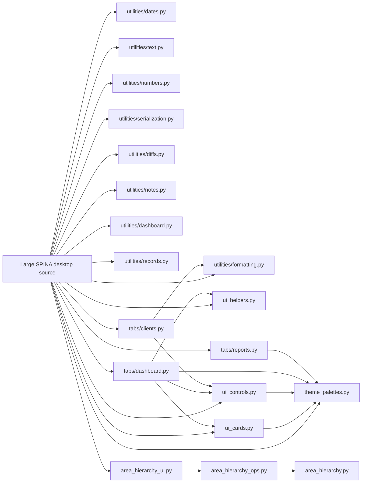

# SPINA Modularization Map

> Permanent source of truth for tracking the separation of the SPINA desktop application into smaller modules.
>
> **Last updated:** 2026-07-24  
> **Tracked main state:** after merged PR #122  
> **Primary desktop source:** `OFFICIAL_SPINA_APP_PostgreSQL_TEST_v33_stability_performance_fixed.py`

## Current status

| Item | Status |
|---|---:|
| Functions extracted from the large desktop source | **78** |
| Focused helper modules receiving extracted functions | **13** |
| Feature-level tab modules | **3** |
| Hierarchical Area production modules | **3** |
| Accelerated modularization waves completed | **19** |
| Latest completed extraction | **Wave 19 / PR #122** |
| Next step | **Wave 20 feature inventory** |

The project has moved from isolated low-risk helper extraction to guarded feature-level modularization. Protected calculation, PostgreSQL write, authentication, report-total, renewal, and filesystem paths remain in their existing owners until focused tests justify moving them.

## Architecture map

## Production module inventory

### Focused helper modules

| Module | Extracted ownership | Helper count |
|---|---|---:|
| `spina_app/utilities/formatting.py` | Currency, money, percentage, compact-money, Collector Close, Dashboard, Cash Control, and Client Information Log formatting | 12 |
| `spina_app/utilities/dates.py` | Date validation, parsing, display, and payment-schedule field normalization | 7 |
| `spina_app/utilities/text.py` | Area/name normalization and Client Information Log action labels | 4 |
| `spina_app/utilities/numbers.py` | Numeric parsing, count parsing, Cash Control amount parsing, and integer-range clamping | 5 |
| `spina_app/utilities/serialization.py` | Safe Client Information Log JSON decoding | 1 |
| `spina_app/utilities/diffs.py` | Client Information Log old/new value comparison | 1 |
| `spina_app/utilities/notes.py` | Note normalization, unique text joining, and note dictionary merging | 3 |
| `spina_app/utilities/dashboard.py` | Dashboard status selection | 1 |
| `spina_app/utilities/records.py` | Database-row-to-dictionary conversion | 1 |
| `spina_app/ui_helpers.py` | Rounded canvas drawing and summary-card value updates | 6 |
| `spina_app/theme_palettes.py` | Modern and legacy Dashboard, Cash Control, Client Information Log, Reports/Clients, and Collector/Collector Route palettes | 7 |
| `spina_app/ui_cards.py` | Cash Control, Client Information Log, Collector Route, and legacy Dashboard card constructors | 4 |
| `spina_app/ui_controls.py` | Cash Control, Client Information Log, Clients, Collector Route, and legacy Dashboard controls and Treeview styling | 8 |
| **Helper total** |  | **60** |

### Feature-level tab modules

| Module | Extracted ownership | Function count | Moved source lines |
|---|---|---:|---:|
| `spina_app/tabs/dashboard.py` | Legacy Dashboard construction, filtering, charts, table population, and refresh orchestration | 5 | 462 |
| `spina_app/tabs/reports.py` | Modern Reports construction, controls, cards, table styling, selection status, and display refresh | 6 | 500 |
| `spina_app/tabs/clients.py` | Modern Clients construction, controls, cards, selection/profile display, and card refresh | 7 | 387 |

The Dashboard, Reports, and Clients modules keep the original function names. The desktop entry module imports them back and supplies application-owned dependencies through late-bound bridges, avoiding circular imports while preserving existing App patching and callbacks.

### Hierarchical Area modules

| Module | Responsibility | Main PRs |
|---|---|---:|
| `spina_app/area_hierarchy.py` | Schema setup, migration, stable Area IDs, unlimited parent/child storage, full legacy-compatible paths, and tree building | #91 |
| `spina_app/area_hierarchy_ops.py` | Rename, move, ordering, activation/deactivation, subtree/client safeguards, legacy synchronization, and stale-UID repair | #93 |
| `spina_app/area_hierarchy_ui.py` | Folder-style Area Manager, expand/collapse tree, modal ownership, managed Area selectors, and client-form integration | #93 |

## Exact extracted ownership

### `spina_app/utilities/formatting.py`

- `fmt_currency` — PR #56
- `_spina_dash__fmt_pct` — PR #58
- `_spina_v23_money` — PR #58
- `_spina_v23_percent` — PR #58
- `_spina_cilog_fmt_money` — PR #63
- `_spina_cilog_fmt_value` — PR #64
- `_spina__fmt_client_money` — PR #72
- `_spina_v17_fmt_short_money` — PR #72
- `_spina_v18_fmt_money_compact` — PR #72
- `_spina_crc_fmt_money` — PR #80
- `_spina_dash__fmt_money` — PR #88
- `_spina_cashctl__fmt_pct` — PR #88

### `spina_app/utilities/dates.py`

- `_spina_cashctl__valid_date` — PR #57
- `_spina__parse_day_ymd` — PR #57
- `_spina_dash__parse_date` — PR #57
- `_spina_dash__date_text` — PR #61
- `_spina_v24_cilog_parse_day` — PR #61
- `_spina__norm_weekday` — PR #96
- `_spina__norm_dom` — PR #96

### `spina_app/utilities/text.py`

- `_oslp__norm_area_name` — PR #59
- `_spina_crc_norm_text` — PR #59
- `_spina_route_notice_norm_name` — PR #59
- `_spina_cilog_action_label` — PR #65

### `spina_app/utilities/numbers.py`

- `_spina_dash__float` — PR #60
- `_spina_v27_count_from_text` — PR #60
- `_spina_v25_parse_count_from_var` — PR #72
- `_spina_cashctl__parse_amount` — PR #98
- `_spina_cashctl__int_range` — PR #98

### Other utility modules

- `spina_app/utilities/serialization.py`
  - `_spina_cilog_safe_json` — PR #62
- `spina_app/utilities/diffs.py`
  - `_spina_cilog_diff_pairs` — PR #66
- `spina_app/utilities/notes.py`
  - `_as_note_dict` — PR #69
  - `_append_unique_text` — PR #70
  - `_merge_note_dict` — PR #71
- `spina_app/utilities/dashboard.py`
  - `_spina_dash__status_for` — PR #80
- `spina_app/utilities/records.py`
  - `_spina_perf_dict_rows` — PR #80

### UI helper modules

- `spina_app/ui_helpers.py`
  - `_spina_v20_round_rect` — PR #74
  - `_spina_v24_cilog_round_rect` — PR #74
  - `_spina_v18_draw_round_rect` — PR #74
  - `_spina_v17_set_card` — PR #74
  - `_spina_v24_cilog_set_card` — PR #74
  - `_spina_v21_cash_set_card` — PR #88
- `spina_app/theme_palettes.py`
  - `_spina_v20_dash_palette` — PR #95
  - `_spina_v21_cash_colors` — PR #95
  - `_spina_v24_cilog_colors` — PR #95
  - `_spina_v22_reports_colors` — PR #107
  - `_spina_v25_collector_colors` — PR #107
  - `_spina_v17_dash_colors` — PR #113
  - `_spina_v18_dashboard_palette` — PR #113
- `spina_app/ui_cards.py`
  - `_spina_v21_cash_card` — PR #100
  - `_spina_v24_cilog_card` — PR #100
  - `_spina_v27_route_card` — PR #111
  - `_spina_v17_make_card` — PR #117
- `spina_app/ui_controls.py`
  - `_spina_v21_build_labeled_entry` — PR #103
  - `_spina_v21_style_cash_table` — PR #103
  - `_spina_v24_cilog_button` — PR #105
  - `_spina_v24_cilog_style_tree` — PR #105
  - `_spina_v23_style_clients_tree` — PR #109
  - `_spina_v27_style_route_trees` — PR #109
  - `_spina_v17_update_filter_buttons` — PR #115
  - `_spina_v17_style_dashboard_table` — PR #115

### `spina_app/tabs/dashboard.py`

- `_spina_v17_visible_dashboard_rows` — PR #118
- `_spina_v17_build_dashboard_tab` — PR #118
- `_spina_v17_draw_dashboard_charts` — PR #118
- `_spina_v17_populate_dashboard_tree` — PR #118
- `_spina_v17_refresh_dashboard` — PR #118

### `spina_app/tabs/reports.py`

- `_spina_v22_style_reports_tree` — PR #121
- `_spina_v22_button` — PR #121
- `_spina_v22_report_card` — PR #121
- `_spina_v22_build_reports_tab` — PR #121
- `_spina_v22_reports_selection_status` — PR #121
- `_spina_v22_update_report_cards` — PR #121

### `spina_app/tabs/clients.py`

- `_spina_v23_button` — PR #122
- `_spina_v23_card` — PR #122
- `_spina_v23_selected_name_lt` — PR #122
- `_spina_v23_refresh_client_profile` — PR #122
- `_spina_v23_build_clients_tab` — PR #122
- `_spina_v23_entry` — PR #122
- `_spina_v23_update_client_cards` — PR #122

## Modularization timeline

### Foundation and safety work

| Stage | PR | Result |
|---|---:|---|
| Redundancy inventory | #1 | Added the first read-only duplicate and shadowed-function audit. |
| Exact duplicate consolidation | #2 | Consolidated proven identical helper bodies while preserving aliases. |
| Quality and startup diagnostics | #4 | Added permanent compilation, redundancy, and quality audits. |
| Shadowed method cleanup | #5 | Removed inactive earlier class-method definitions while preserving active implementations. |
| Diagnostic and cleanup planning | #6–#53 | Added audits and narrow dry-run/apply tools for performance, exceptions, legacy UI, dynamic SQL, patch chains, and protected contexts. |
| Module-separation planner | #54 | Added the read-only source and dependency planner. |
| Guarded extraction framework | #55 | Created the initial `spina_app` package and safe extraction process. |

### Foundational helper extractions

| PR | Module(s) | Extracted scope | Status |
|---:|---|---|---|
| #56 | `utilities/formatting.py` | First production extraction: `fmt_currency` | ✅ Merged |
| #57 | `utilities/dates.py` | Three pure date helpers | ✅ Merged |
| #58 | `utilities/formatting.py` | Three display formatters | ✅ Merged |
| #59 | `utilities/text.py` | Three text/name normalizers | ✅ Merged |
| #60 | `utilities/numbers.py` | Two numeric parsers | ✅ Merged |
| #61 | `utilities/dates.py` | Two date display/parsing helpers | ✅ Merged |
| #62 | `utilities/serialization.py` | Safe Client Information Log JSON parser | ✅ Merged |
| #63 | `utilities/formatting.py` | Client Information Log money formatter | ✅ Merged |
| #64 | `utilities/formatting.py` | Client Information Log value formatter | ✅ Merged |
| #65 | `utilities/text.py` | Client Information Log action label | ✅ Merged |
| #66 | `utilities/diffs.py` | Client Information Log diff pairs | ✅ Merged |
| #69 | `utilities/notes.py` | Note dictionary normalizer | ✅ Merged |
| #70 | `utilities/notes.py` | Unique note-text append helper | ✅ Merged |
| #71 | `utilities/notes.py` | Note dictionary merge helper | ✅ Merged |

PR #67 was a paused note-helper attempt and closed without merging. PR #68 was a Reports Notes UI fix rather than a module extraction.

### Accelerated modularization waves

| Wave | Inspection/working PRs | Final extraction PR | Destination | Extracted scope | Desktop result |
|---:|---|---:|---|---|---|
| 1 | Batch scan/guard work | #72 | `utilities/formatting.py`, `utilities/numbers.py` | Client/Dashboard compact money and count parsing | ✅ Passed and merged |
| 2 | #73 temporary | #74 | `ui_helpers.py` | Rounded rectangles and Dashboard/CILOG card updates | ✅ Passed and merged |
| 3 | #75–#79 temporary | #80 | `utilities/dashboard.py`, `utilities/records.py`, `utilities/formatting.py` | Dashboard status, row conversion, Collector Close money | ✅ Passed and merged |
| 4 | #81–#87 temporary | #88 | `utilities/formatting.py`, `ui_helpers.py` | Dashboard/Cash Control display helpers | ✅ Passed and merged |
| 5 | #94 inspection | #95 | `theme_palettes.py` | Dashboard, Cash Control, and CILOG palettes | ✅ Passed and merged |
| 6 | Direct guarded extraction | #96 | `utilities/dates.py` | Payment-schedule weekday/day-of-month normalization | ✅ Passed and merged |
| 7 | #97 inspection | #98 | `utilities/numbers.py` | Cash Control amount and range normalization | ✅ Passed and merged |
| 8 | #99 inspection | #100 | `ui_cards.py` | Cash Control and CILOG card constructors | ✅ Passed and merged |
| 9 | #102 inspection | #103 | `ui_controls.py` | Cash Control labeled entries and Treeview styling | ✅ Passed and merged |
| 10 | #104 inspection | #105 | `ui_controls.py` | Client Information Log buttons and Treeview styling | ✅ Passed and merged |
| 11 | #106 inspection | #107 | `theme_palettes.py` | Reports/Clients and Collector/Collector Route base palettes | ✅ Passed and merged |
| 12 | #108 inspection | #109 | `ui_controls.py` | Clients and Collector Route Treeview styling | ✅ Passed and merged |
| 13 | #110 inspection | #111 | `ui_cards.py` | Collector Route summary-card constructor | ✅ Passed and merged |
| 14 | #112 inspection | #113 | `theme_palettes.py` | Legacy Dashboard light/dark palette helpers | ✅ Passed and merged |
| 15 | #114 inspection | #115 | `ui_controls.py` | Legacy Dashboard filter-button and Treeview styling helpers | ✅ Passed and merged |
| 16 | #116 inspection | #117 | `ui_cards.py` | Legacy Dashboard summary-card constructor | ✅ Passed and merged |
| 17 | #118 inventory and working PR | #118 | `tabs/dashboard.py` | Complete legacy Dashboard presentation/orchestration group: 5 functions, 462 lines | ✅ Passed and merged |
| 18 | #121 inventory and working PR | #121 | `tabs/reports.py` | Modern Reports presentation group: 6 functions, 500 lines | ✅ Passed and merged |
| 19 | #122 inventory and working PR | #122 | `tabs/clients.py` | Modern Clients presentation group: 7 functions, 387 lines | ✅ Passed and merged |

Temporary inspection/apply PRs are deliberately closed without merging and are not counted as completed production waves.

## Area-system modularization

The unlimited Area work is tracked separately because it introduced a complete feature module set rather than moving a few helpers.

| Phase | PR | Result | Status |
|---|---:|---|---|
| Dependency inspection | #90 | Mapped the original flat Area text model and compatibility requirements | Closed, not merged |
| Storage foundation | #91 | Added `area_hierarchy.py`, `area_nodes`, `clients.area_uid`, migration, and legacy-path compatibility | ✅ Merged |
| UI inspection | #92 | Located both client Area controls and the old manager | Closed, not merged |
| Folder manager and operations | #93 | Added `area_hierarchy_ops.py`, `area_hierarchy_ui.py`, folder tree, selectors, safeguards, and freeze fixes | ✅ Merged |

PR #89 attempted a fixed two-level Area model and was closed because it did not meet the unlimited hierarchy requirement.

## Permanent safety process

Every new extraction must follow this sequence:

1. Start from the latest `main` commit.
2. Begin with a read-only inventory of exact source, signatures, dependencies, callers, risk areas, and occurrences.
3. A narrow helper wave may use separate inspection and extraction PRs; a cohesive feature-level wave may use one working PR whose first commit is inventory-only.
4. Select one cohesive group and capture original behavior before moving code.
5. Replace original definitions with same-name imports and preserve callers.
6. Keep protected database, calculation, authentication, and filesystem services in their existing owners unless focused tests justify moving them.
7. Compile the application and destination modules and compare preserved behavior.
8. Run Python, redundancy, feature regression, and SPINA quality audits.
9. Remove all temporary write-enabled workflows.
10. Add permanent read-only regression CI.
11. Perform a Windows desktop smoke test.
12. Merge production code only after the desktop test passes.
13. Update this map in the same wave or through a documentation-only follow-up PR.

## Protected and deferred areas

These require stronger domain tests before modularization:

- PostgreSQL compatibility layer, SQL classification, migrations, and critical writes
- payment entry and payment allocation
- principal, balance, interest, and 7x7 calculations
- renewal and offset logic
- due-date and payment-term formulas beyond tested input normalization
- report totals and PDF mathematics
- Collector Route and large ledger builders
- authentication, account recovery, permissions, and role access
- backup/restore and filesystem operations
- client picture/file handling
- startup lifecycle, global logging, and broad application infrastructure
- large Tkinter tab/build/refresh groups without deterministic feature tests

A deferred item becomes eligible only after focused behavior or calculation tests exist and its dependencies are understood.

## Future-wave tracker

| Wave | Inventory/inspection PR | Extraction PR | Module | Helpers/Classes | CI | Desktop test | Merge | Notes |
|---:|---:|---:|---|---|---|---|---|---|
| 9 | #102 | #103 | `spina_app/ui_controls.py` | 2 Cash Control UI helpers | ✅ | ✅ | ✅ | Completed |
| 10 | #104 | #105 | `ui_controls.py` | CILog button and Treeview style helpers | ✅ | ✅ | ✅ | Passed Windows smoke test |
| 11 | #106 | #107 | `theme_palettes.py` | Reports and Collector base palette helpers | ✅ | ✅ | ✅ | Passed Windows smoke test |
| 12 | #108 | #109 | `ui_controls.py` | Clients and Collector Route Treeview style helpers | ✅ | ✅ | ✅ | Passed Windows smoke test |
| 13 | #110 | #111 | `ui_cards.py` | Collector Route summary-card constructor | ✅ | ✅ | ✅ | Passed Windows smoke test |
| 14 | #112 | #113 | `theme_palettes.py` | Two legacy Dashboard palette helpers | ✅ | ✅ | ✅ | Passed Windows smoke test |
| 15 | #114 | #115 | `ui_controls.py` | Legacy Dashboard filter-button and Treeview style helpers | ✅ | ✅ | ✅ | Passed Windows smoke test |
| 16 | #116 | #117 | `ui_cards.py` | Legacy Dashboard summary-card constructor | ✅ | ✅ | ✅ | Passed Windows smoke test |
| 17 | #118 | #118 | `tabs/dashboard.py` | 5 Dashboard feature functions; 462 lines moved | ✅ | ✅ | ✅ | Passed Windows smoke test |
| 18 | #121 | #121 | `tabs/reports.py` | 6 Reports feature functions; 500 lines moved | ✅ | ✅ | ✅ | Passed Windows smoke test and self-hosted audits |
| 19 | #122 | #122 | `tabs/clients.py` | 7 Clients feature functions; 387 lines moved | ✅ | ✅ | ✅ | Passed Windows smoke test and self-hosted audits |
| 20 | Pending | Pending | Pending | Select through current-main feature inventory | ⬜ | ⬜ | ⬜ | Not started |

Status legend:

- ✅ completed and merged
- 🔎 inventory, inspection, or review in progress
- 🧪 extraction or testing in progress
- ⏸ deferred or protected
- ❌ closed or superseded without merge
- ⬜ not started

## Branch and PR hygiene

- `main` is the stable source of truth.
- Create every inventory, inspection, and extraction branch from current `main`.
- Do not continue old closed temporary branches.
- Do not merge inspection-only PRs.
- Do not keep a write-enabled GitHub Actions workflow in a final production or documentation PR.
- Use the tested head SHA when merging.
- PR #3 remains an old review branch and is not part of the current modularization mainline.

## Completion checklist

Before marking a production wave complete, confirm:

- [ ] Same-name imports replace the original definitions.
- [ ] Destination functions contain the preserved bodies.
- [ ] Existing callers remain unchanged unless explicitly tested.
- [ ] Original-versus-extracted behavior matches.
- [ ] Application and destination modules compile.
- [ ] Python audit passes.
- [ ] Redundancy audit passes.
- [ ] Focused feature or helper regression CI passes.
- [ ] SPINA quality audit passes.
- [ ] Permanent read-only regression CI exists.
- [ ] Temporary inspection/write workflows are removed.
- [ ] Windows desktop smoke test passes.
- [ ] Production PR is merged into `main`.
- [ ] This map is updated.
