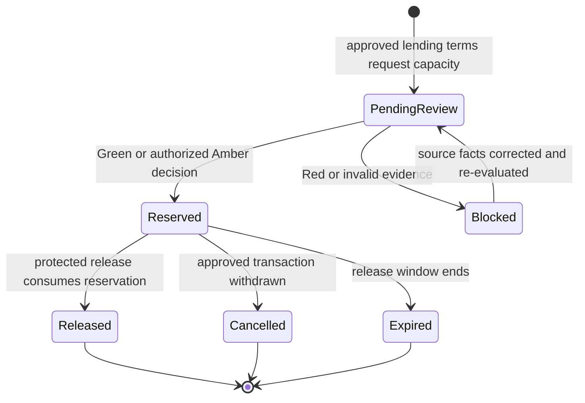

# Office Working Fund and New Client Fund Design

**Date:** 2026-08-28

**Repository:** `GILBIC/spina-lending-app`

**Status:** Business design approved in conversation; written specification
awaiting Management review before implementation planning

## Outcome

SPINA will let authorized office personnel manage routine cash without requiring
the owner to handle every release, while Management retains an accurate,
drillable view of where the cash is, who holds it, what it is committed to, and
how much is actually available.

The selected architecture is one **Office Working Fund** backed by official
cash-ledger and custody records. **New Client Fund** is the user-facing name for
the tracked allocation and decision support used to admit new clients. It is not
a second bank account, physical envelope, cash balance, or general-ledger
account. Renewals, new-client releases, authorized expenses, and transfers
reserve tagged amounts from the same real cash without duplicating it.

The **New Client Fund Capacity Guard** determines whether SPINA can safely fund a
specific approved applicant. It is deterministic and server-authoritative. It
does not replace credit approval, and predictive AI cannot approve a client,
invent a balance, or override policy.

## Current behavior and target behavior

| Area | Current implemented evidence | Intended behavior from this design |
|---|---|---|
| Cash disbursement | Migration `0045_add_authoritative_loan_disbursement_evidence.sql` records actual new-loan, renewal, and restructure disbursement evidence with a funding account. | A protected reservation exists before release and is consumed atomically by the existing authoritative disbursement path. |
| Renewal execution | Migration `0050_add_authoritative_renewal_execution_evidence.sql` separates new principal, old-loan settlement, deductions, and cash disbursed. The renewal workflow records Management release and Collector/Client handover evidence. | The Office Working Fund reserves the exact renewal net cash release and any separately payable immediate cash obligation without treating the old-loan settlement as new cash. |
| Cash custody | Existing protected accounting and remittance slices distinguish office, collector-custody, bank, and approved GCash accounts. | Every included cash amount has an approved location and custodian, reconciliation state, and linked movement evidence. |
| Availability and commitments | The repository does not currently contain a dedicated authoritative working-fund reservation or new-client admission-capacity module. | FastAPI/PostgreSQL derive spendable cash, serialize reservations, prevent overcommitment, and explain each decision. |
| Desktop cash controls | Legacy Desktop documentation includes local cash-control and forecast calculations. | The current Desktop evolves to consume the protected shared service; legacy local calculations do not become authority. |

Planned records, screens, and formulas in this document are not implemented
production behavior until their migrations, protected services, clients, and
tests are merged and released through Master Issue #296.

## Domain model

### One real fund

The Office Working Fund is the official collection of company cash assigned to
approved office-controlled locations and custodians for routine operations. A
Management view may group or label the fund by purpose, but all purpose amounts
reconcile to the same underlying custody balances.

Approved custody locations can include an office safe, cashier drawer, bank,
approved GCash account, and an explicitly authorized employee custodian.
Collector Cash Custody remains a separate custody state. An expected or
unremitted Collector amount does not increase Cleared Office Cash until the
protected handover/remittance workflow records office acceptance and the amount
is reconciled.

An internal movement from bank to office, safe to drawer, or one approved
custodian to another changes asset location and custody. It is neither income
nor expense. An owner cash top-up is a capital contribution only when supported
by the required source and approval evidence.

### Derived balances

- **Gross Office Cash** is the sum of official cash-ledger balances at locations
  included by the active working-fund policy.
- **Cleared Office Cash** is the portion of Gross Office Cash supported by
  accepted custody and reconciliation evidence before separate availability
  holds are deducted. Cash never accepted into office custody is excluded.
- **Minimum Operating Reserve** is the policy-protected amount that routine
  releases cannot consume.
- **Active Cash Reservations** are unexpired, unconsumed commitments for one
  exact approved document version and purpose: new-client release, renewal net
  release, authorized expense or liability, or approved cash transfer.
- **Blocked Cash** is the portion of Cleared Office Cash made unavailable because
  of a discrepancy, expired reconciliation window, hold, disputed evidence, or
  another protected restriction.
- **Spendable Office Cash** is a read model calculated from official evidence:

  `Spendable Office Cash = Cleared Office Cash - Minimum Operating Reserve - Active Cash Reservations - Blocked Cash`

Reservations must include every approved pending cash outflow exactly once.
Upcoming obligations that are not yet approved reservations remain visible in
the forecast but are not subtracted a second time. Negative Spendable Office
Cash is a blocking discrepancy; a client cannot hide it by changing a screen
value.

### New Client Fund

New Client Fund is the Management-facing view of how much of Spendable Office
Cash can support new-client releases under the active policy. It contains:

- current unreserved headroom;
- active new-client reservations and their expiry;
- exact decisions for reviewed applications;
- estimated additional clients fundable by configured loan-size tier;
- the assumptions and policy version behind every result.

The estimate by loan-size tier is advisory and never a cash balance or promise.
The protected decision for a real applicant always uses that applicant's exact
approved terms and current authoritative records.

### Renewal funding

A renewal displays gross new principal, old-loan settlement, deductions, and net
cash release separately. The working fund reserves the exact net cash release,
plus any separately identified immediate third-party cash obligation when one
actually leaves custody. The old-loan settlement is an internal offset and does
not require the office to produce that amount as new physical cash.

Renewal and new-client reservations coexist in the same fund. Priority is
determined by a versioned Management policy and the approved business timestamp,
not by moving money between invented sub-accounts. Each release preserves its
client and loan identity; one client's reserved cash cannot be silently
reassigned to another.

## New Client Fund Capacity Guard

### Separate qualification from capacity

A client must first satisfy the lending approval contract. The Capacity Guard
then answers a different question: whether SPINA can fund the approved terms
without breaching cash, portfolio, or operating policy. Sufficient cash cannot
make an unqualified applicant eligible, and an approved applicant can remain in
a funding queue when capacity is unavailable.

### Inputs

The server reads one consistent, locked decision snapshot containing:

- the exact approved client, product, principal, deductions, net release,
  effective date, and document version;
- Cleared Office Cash, Minimum Operating Reserve, Active Cash Reservations, and
  Blocked Cash;
- approved immediate obligations falling within the policy horizon, deduplicated
  against any existing Cash Reservation for the same source obligation;
- conservative short-term cash-flow assumptions from versioned policy and
  reconciled historical evidence;
- portfolio exposure, arrears, concentration, product, and branch limits;
- available Collector/route/area capacity and required service coverage;
- reconciliation freshness, approved custody location, authorized releaser,
  and device state.

All thresholds and the forecast horizon are explicit, versioned Management
policy. The guard fails closed if a required threshold is absent, the source
snapshot is stale, or authoritative records disagree.

### Exact cash test

The **Proposed Client Cash Requirement** is the approved net cash release plus
any separately payable immediate cash outflow created by the same transaction.
Loan principal, taxes, deductions, payables, and net release remain itemized; a
net number never hides gross credit exposure or an obligation.

The hard current-cash test is:

`Post-admission Headroom = Spendable Office Cash - Proposed Client Cash Requirement`

It passes only when Post-admission Headroom is non-negative. A second
policy-horizon test projects cleared cash after approved obligations using
conservative, versioned assumptions. Forecast collections cannot substitute for
cash that must be present at release time.

### Explainable result

The guard returns one result with machine-readable reason codes and a human
explanation:

- **Green — Fundable:** credit approval is current, the hard cash and forecast
  tests pass, portfolio and operating limits pass, and the reservation can be
  created atomically under delegated authority.
- **Amber — Management review:** no hard prohibition exists, but the decision is
  near a configured reserve, forecast, concentration, daily aggregate,
  Collector/route-capacity, or delegated-authority threshold. No reservation is
  active until an authorized Management decision succeeds.
- **Red — Not fundable now:** current cash is insufficient, a hard policy limit
  fails, approval or evidence is invalid, reconciliation is stale, custody is
  blocked, or the exact amount cannot be reserved. The result identifies the
  failed controls without weakening them.

The result is advice plus protected workflow state, not autonomous lending.
Management or a specifically delegated authorized person remains accountable
for the business decision.

### Concurrency and reservation rule

Approval and reservation execute in one protected database transaction. The
server locks or otherwise serializes the relevant fund-policy and balance
snapshot, recalculates current headroom, rejects stale document versions, and
creates at most one active reservation for the exact loan/application version.
This prevents two simultaneous Green decisions from spending the same cash.

The same idempotency key must replay the same result. A different amount,
application version, location, or purpose under the same key is rejected.

## Reservation and release lifecycle

Partial release is not part of the initial design. A changed amount or terms
creates a new reviewed document version and a replacement reservation; it does
not mutate a consumed or expired commitment. Cancellation and expiry release
capacity but preserve permanent history and reasons.

The protected release must consume the reservation and create or link the
existing loan-disbursement, custody, accounting-source, and audit evidence in
one reliable workflow. An uncertain retry cannot create a second release.

## Delegated office authority

Owner is not a fifth canonical platform role. The owner operates through the
Management role with explicit oversight, policy, approval, and reporting
permissions.

Employee and Management permissions remain separable, including:

- prepare a transaction or reservation request;
- hold cash as an approved custodian;
- release an already approved loan under delegation;
- perform or attest a physical count;
- reconcile custody and source evidence;
- review an Amber decision or discrepancy;
- approve policy or a protected correction.

Delegated Cash Authority is versioned and bounded by actor, purpose, location,
maximum single release, daily aggregate, minimum reserve, allowed product or
account, effective period, and approved device policy. Routine approved releases
within those bounds can proceed without a fresh owner action. Large or unusual
releases, policy changes, reserve breaches, shortages, overages, evidence gaps,
reversals, and discrepancies return to Management review. A maker cannot approve
their own sensitive transaction.

## Accounting treatment

A reservation is memorandum/commitment evidence. It does not create a general
ledger journal and does not reduce cash until a real release occurs.

- Bank-to-office or custodian-to-custodian movement transfers one cash asset
  between approved locations.
- An evidenced owner top-up records cash and owner capital contribution.
- A new-loan release records the protected cash movement and loan receivable
  using the existing authoritative disbursement accounting path.
- A renewal records its linked settlement, deductions, and net cash release
  under the protected renewal contract.
- An office expense or liability settlement uses its own source document and
  journal path.

Employees record source events and reconcile custody. Management totals and
New Client Fund capacity are derived; neither is a manually entered dashboard
field. Posted corrections use linked reversals and replacement evidence.

## Management views and operating rhythm

Management can drill from one cash position into:

- cash by bank, approved GCash account, office safe, cashier drawer, employee,
  and Collector custody;
- current custodian and latest accepted reconciliation;
- beginning balance, receipts, accepted remittances, releases, expenses,
  transfers, and ending balance;
- active new-client and renewal reservations;
- Spendable Office Cash and New Client Fund headroom;
- exact Green/Amber/Red decisions and reason codes;
- shortages, overages, stale evidence, blocked cash, and approval queues;
- daily and monthly cash movement and delegated-limit usage.

Authorized custodians perform a physical count and reconciliation on the
configured operating schedule and at every custody handover. A discrepancy
blocks the affected amount or custody location according to policy and remains
assigned and visible until resolved through evidence or a protected correction.

## Service boundaries

FastAPI owns command validation, authorization, decision explanations,
idempotency, and official responses. PostgreSQL owns policy versions,
reconciled balances, custody, reservations, decisions, releases, and permanent
audit evidence. Desktop, Mobile, and Web render the same server result and may
request an authorized command; they do not calculate official availability or
change the outcome locally.

The first implementation plan must preserve and integrate with the existing
authoritative disbursement and renewal evidence rather than replace it. Legacy
Desktop cash calculations can supply inventory and parity cases only. Earlier
portals and their backends remain external and cannot become a second working-
fund authority.

## Failure behavior

- Insufficient or newly committed cash rejects reservation with the current
  authoritative headroom and reason code.
- Stale approval, terms, policy, reconciliation, assignment, device, or custody
  evidence fails closed and names the item that must be refreshed.
- A concurrent winner may reserve funds; the losing request recalculates and
  returns Amber or Red rather than using the old Green result.
- A timeout is retried with the same idempotency key; the server returns the
  original decision or release outcome.
- A ledger/custody disagreement blocks the affected cash and opens a discrepancy
  instead of adjusting a dashboard total.
- Cancellation, expiry, reversal, and correction remain append-only and fully
  linked to their original records.

## Verification matrix for a future implementation

The implementation plan must include at least:

- exact formula tests for cleared, reserved, blocked, and spendable cash;
- new-client and renewal net-cash examples with gross exposure and deductions
  separately asserted;
- unremitted Collector cash exclusion and accepted-handover inclusion tests;
- Green, Amber, and every Red reason-code boundary;
- absent-policy, stale-reconciliation, blocked-location, and insufficient-fund
  fail-closed tests;
- simultaneous-reservation and idempotent-retry tests proving no overcommit;
- reservation expiry, cancellation, changed-document-version, release, and
  protected-correction tests;
- delegation ceiling, daily aggregate, purpose, location, device, and
  maker-checker negative tests;
- ledger, custody, disbursement, renewal, journal, and audit atomicity tests;
- Desktop/Mobile/Web contract parity and prohibited local-authority tests;
- migration inventory, historical reconciliation, disposable rehearsal,
  rollback/recovery, UAT, physical-count, and Management acceptance evidence.

## Rejected alternatives

- **Separate physical New Client and Renewal funds:** rejected because it
  fragments custody, encourages duplicate balances, and makes idle cash harder
  to use while reservations already protect commitments.
- **A simple editable cash log:** rejected because it cannot serialize
  decisions, prevent overcommitment, preserve accounting identity, or prove
  custody.
- **AI-only admission:** rejected because cash sufficiency and lending authority
  require deterministic, reproducible controls and accountable approval.
- **Forecast collections as current cash:** rejected because expected receipts
  are not available custody and can fail to arrive.

## Delivery boundary

This written design is a Phase 2 accounting and cash-control subproject under the
platform migration design. After Management reviews this file, the next allowed
step is a separate implementation plan covering migrations, protected service
contracts, Desktop integration, tests, data rehearsal, and release gates.

This document does not authorize implementation, a database migration, live
cash or capital entry, deployment, service restart, merge, or production data
change.
