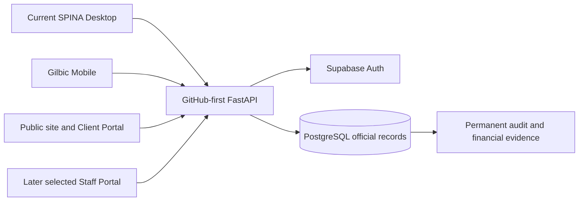
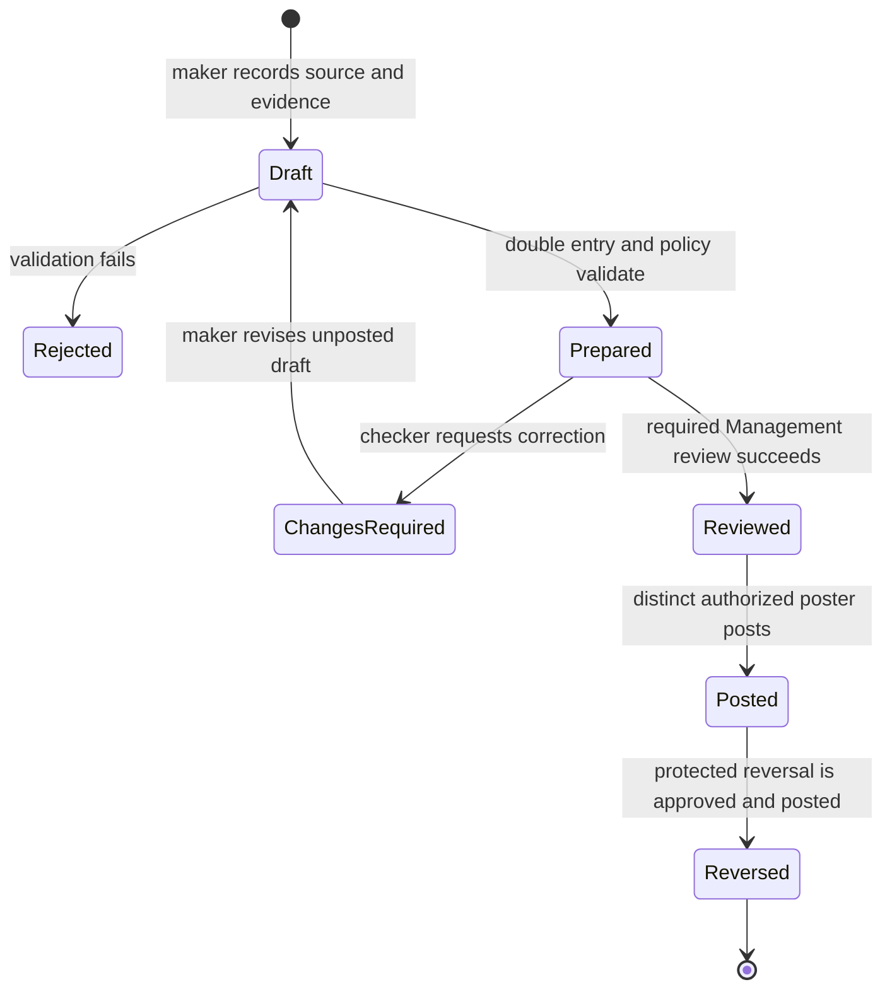

# SPINA Platform Direction and Migration Design

**Date:** 2026-08-28

**Repository:** `GILBIC/spina-lending-app`

**Starting commit:** `e1c252899f0a7f5f1b8dfc65d31fa2c857e86183`

**Working branch:** `codex/spina-platform-direction`

**Parent:** Draft PR #372, based on the active Master Issue #296 stack

**Status:** Product direction approved; written design awaiting Management review

## Outcome

Evolve the applications in the current repository into one platform: SPINA
Desktop as the primary office application, Gilbic Mobile as the role-appropriate
mobile application, a public website and secure Client Web Portal, and a later
selected Staff Web Portal. All surfaces share Supabase identity, FastAPI
authorization and commands, PostgreSQL official records, approved-device rules,
and permanent audit evidence.

The stable intended behavior is defined in
[`docs/architecture/platform-direction.md`](../../architecture/platform-direction.md),
and domain terms are defined in [`CONTEXT.md`](../../../CONTEXT.md). This design
defines how the current implementation can reach that target without copying the
old Desktop, reconnecting a second backend, or inheriting legacy access.

## Architecture decision

The selected approach is a server-authority migration by bounded domain:

Desktop remains the current project and evolves behind APIs incrementally. A
bounded migration keeps proven workflows available while each domain gains a
server contract, protected command path, parity tests, data reconciliation, and
account cutover. Direct Desktop database behavior remains current reality during
transition, not a target pattern.

## Clean authorization design

The platform defines Management, Employee, Collector, and Client from current
responsibility and resource scope. It also defines narrow action permissions and
separation-of-duty constraints. The four canonical roles are not four broad
access switches: Employee accounting, HR, payroll, and client-relationship
access are independently composable; Collector access is assignment/delegation
scoped; Client access is own-record only; Management permissions remain explicit
and sensitive approval is distinct from preparation.

`Admin`, `Encoder`, `Viewer`, and `System` are historical Desktop access profiles
only. The migration deliberately contains no crosswalk from those names to the
new roles or permissions. A legacy value may be stored in cutover evidence but
must never be read by authorization code to calculate a grant.

The cutover record must identify the legacy account, new server account,
Management approver, chosen canonical role, individual permission grant set,
resource scopes, device state, positive/negative access-test evidence, legacy
disable time, and recovery/acceptance outcome. Historical records are
append-only. Cutover proceeds one account at a time.

## Accounting domain design

### Source-first recording

Employees record source transactions and evidence for assets, liabilities, and
equity. Dashboards are read models derived from posted journals, protected
subledgers, custody, depreciation, due state, and reconciliation. There is no API
or Desktop field for directly setting total assets, liabilities, equity,
profitability, or cash custody totals.

The implementation program will need bounded subdomains for:

- source documents and transaction identity;
- chart of accounts and balanced journal drafts;
- review, approval, posting, close/lock, reversal, and replacement;
- cash and collector custody by location and custodian;
- bank, petty-cash, receivable, and payable reconciliation;
- property/equipment/vehicle/supply register, condition, location, custodian,
  depreciation, transfer, and disposal;
- liability obligations, due dates, settlement, and accruals;
- capital contributions, withdrawals/distributions, retained earnings, and
  current profit or loss;
- discrepancies, assignments, evidence, resolution, and permanent audit;
- derived financial position and Management review queues.

### Maker-checker state flow

Sensitive entries cannot be reviewed or posted by the same actor who prepared
them. The server validates balanced debits/credits, active periods, evidence,
account/scope policy, idempotency, and approval state inside the protected
transaction. A correction to posted work creates a linked reversal and, when
needed, a new replacement entry; it never edits or deletes posted history.

### Financial-position contract

Management receives server-derived totals and drill-downs for assets,
liabilities, equity, the accounting equation, cash by custody, unremitted
collector cash, receivables and overdue accounts, upcoming obligations, asset
condition/location/custodian/depreciation, capital movements, retained earnings,
profitability, discrepancies, and approval queues. Any disagreement between a
summary and its posted evidence is a reconciliation failure, not a value that a
user can manually overwrite.

## Platform delivery design

### Desktop

Move identity and read models first, followed by protected commands per bounded
domain. Preserve existing proven financial behavior with characterization and
parity tests. During dual operation, make the authoritative source explicit for
every workflow; prohibit ambiguous two-way writes. Retire a direct database path
only after data reconciliation, API parity, authorization tests, UAT, recovery
evidence, and account acceptance pass.

### Mobile

Keep Collector mobile-first and assignment-scoped. Complete current Collector
work before treating placeholder Client, Employee, or Management destinations as
delivered. Expand each role only after the corresponding backend command, device
policy, server authorization, audit, and official-result contract is proven.

### Website

Create a new frontend in this repository only after its scope and contract plan
are approved. Phase 1 combines public information/inquiries with a separately
secured responsive Client Portal. Reuse FastAPI; do not copy or reconnect the
legacy external backend. Staff web is a later project containing selected remote
workflows, not a browser clone of Desktop.

## Data migration and coexistence rules

1. Inventory schemas, users, source records, identifiers, dependencies, and
   deployed legacy surfaces before writing a migration.
2. Define canonical identities and deterministic reconciliation rules; preserve
   source identifiers and provenance.
3. Rehearse on disposable copies and produce record counts, monetary totals,
   exception lists, equation checks, and recovery evidence.
4. Migrate a bounded domain in an idempotent, forward-only operation.
5. During coexistence, designate exactly one write authority for each record
   class and expose the status to operators.
6. Run automated comparison and UAT before cutover.
7. Cut over accounts and workflows in controlled groups, monitor discrepancies,
   and retain an approved recovery path.
8. Decommission legacy access only after zero active dependencies are evidenced;
   retain historical data according to audit and retention policy.

## Test and release gates

Each bounded implementation plan must include:

- permission-matrix tests, denied-resource tests, and maker-checker tests;
- approved, pending, revoked, mismatched, and unknown-device tests;
- journal balance, posting, reversal, period, idempotency, concurrency, and
  immutable-audit tests;
- migration bootstrap, upgrade, replay, count, monetary-total, equation, and
  recovery-rehearsal tests;
- Desktop parity and prohibited-direct-write tests;
- Flutter and web own-record/assignment-scope tests;
- API contract, accessibility, security, UAT, operational runbook, backup, and
  recovery evidence;
- the permanent gates and exact-head CI requirements in Master Issue #296.

No placeholder screen, unmerged Draft PR, skipped protected-database suite, or
manual happy-path demonstration counts as completed behavior.

## Phased program and subproject specifications

The approved dependency sequence is:

1. architecture approval and complete inventory;
2. authorization, device, audit, and separation-of-duty foundation;
3. authoritative data and accounting foundation;
4. bounded current-Desktop migration and account cutover;
5. independently gated V1 surface lanes for Management, Employee, Collector,
   and Client mobile on Android first and then iOS, plus the Client Web Portal,
   with their exact release order controlled by Master Issue #296;
6. the approved public company/inquiry website, after GitHub planning classifies
   whether it is a V1 blocker or a separately scheduled release item;
7. separately scoped Staff Web Portal and evidence-backed legacy retirement.

This sequence does not reorder the active Draft PR stack. The program is
intentionally too large for one implementation plan. After this written design
is reviewed, each numbered phase must receive its own design or
implementation plan, task breakdown, migration boundary, test matrix, recovery
criteria, and explicit approval. Existing Draft PRs remain Draft and are neither
merged nor expanded automatically by this design.

## Approval boundary

This document records the approved product intention and the proposed migration
architecture. Management review of the written document is the gate before
detailed implementation planning. No large implementation, merge, deployment,
restart, protected database mutation, or production cutover is authorized here.
